# 1. Настройка имён и IP-адресации на устройствах rtr-cod и rtr-a

### Вариант реализации:

#### 

#### rtr-cod (ecorouter):

##### Назначение имени на устройство:

* Для назначения имени устройства согласно требованиям задания используем следующие команды:
  1. переходим в режим администрирования **(enable);**
  2. переходим в режим конфигурации **(configure terminal);**
  3. задаём имя устройству **(hostname <NAME>);**
  4. задаём доменное имя **(ip domain-name <DOMAIN\_NAME>);**
  5. сохраняем конфигурацию **(write memory).**

```bash
ecorouter>enable

ecorouter#configure terminal 

Enter configuration commands, one per line.  End with CNTL/Z.

ecorouter(config)#hostname rtr-cod

rtr-cod(config)#ip domain-name cod.ssa2026.region

rtr-cod(config)#write memory

Building configuration...


rtr-cod(config)#
```

* Проверить имя устройства можно командой **show hostname** из режима администрирования **(enable):**

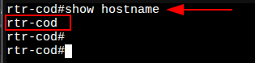

* Проверить доменное имя устройства можно командой **show running-config | include domain-name** из режима администрирования (**enable**):

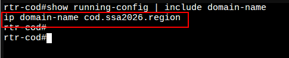

##### Назначение IP-адресов на устройство:

* Основные понятия касающиеся EcoRouter:
  1. **Порт (port)** – это устройство в составе EcoRouter, которое работает на физическом уровне (L1);
  2. **Интерфейс (interface)** – это логический интерфейс для адресации, работает на сетевом уровне (L3);
  3. **Service instance (Сабинтерфейс, SI, Сервисный интерфейс)** является логическим сабинтерфейсом, работающим на канальном уровне (L2) и связывает L1, L2 и L3 уровни:
     + Данный вид интерфейса необходим для соединения физического порта с интерфейсами L3, интерфейсами bridge, портами;
     + Используется для гибкого управления трафиком на основании наличия меток VLANов в фреймах, или их отсутствия;
     + Сквозь сервисный интерфейс проходит весь трафик, приходящий на порт.
* Таким образом, для того чтобы назначить IPv4-адрес на EcoRouter, необходимо придерживаться следующего алгоритма в общем виде:
  1. Создать интерфейс с произвольным именем и назначить на него IPv4-адрес;
  2. В режиме конфигурирования порта создать service-instanceс произвольным именем:
     + указать (инкапсулировать) что будет обрабатываться тегированный или не тегированный трафик;
     + указать в какой интерфейс (ранее созданный) нужно отправить обработанные кадры.

* Посмотреть физические порты можно командой **show port brief** из режима администрирования (**enable**):
  + порт **te0** направлен в сторону ВМ **isp**;
  + порт **te1** направлен в сторону ВМ **fw-cod**.

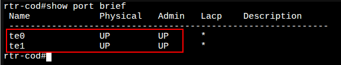

> **isp** — внешний интерфейс (L3), подключение к провайдеру **ISP**

* Создадим интерфейс с именем **isp** и назначим на него IP-адрес **178.207.179.4/29**, также зададим для данного интерфейса описание (description - опциональный, необязательный параметр):

```bash
rtr-cod(config)#interface isp

rtr-cod(config-if)#ip address 178.207.179.4/29

rtr-cod(config-if)#description "Connecting to an ISP provider"

rtr-cod(config-if)#exit

rtr-cod(config)#
```

> **fw-cod** — внутренний интерфейс (L3), подключение к межсетевому экрану **fw-cod**

* Создадим интерфейс с именем **fw-cod** и назначим на него IP-адрес **172.16.1.1/30**, также зададим для данного интерфейса описание (description - опциональный, необязательный параметр):

```bash
rtr-cod(config)#interface fw-cod

rtr-cod(config-if)#ip address 172.16.1.1/30

rtr-cod(config-if)#description "Connecting to fw-cod"

rtr-cod(config-if)#exit

rtr-cod(config)#
```

* Проверить назначенные IP-адреса на интерфейсы можно командой **show ip interface brief** из режима администрирования **(enable):**
  + созданные интрфейсы пока не добавлены в какие-либо **Service instance**, а значит не привязаны и к порту, отсюда и статус **down**

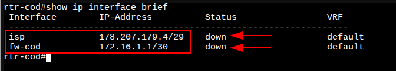

> **te0** — внешний порт, обращён в сторону машины **ISP**

* В режиме конфигурирования порта **te0** необходимо создать **service-instance** с произвольным именем, например **te0/isp**:
  + также необходимо указать (инкапсулировать) что будет обрабатываться не тегированный трафик (**untagget**);
  + и указать в какой интерфейс (ранее созданный с именем **isp**) нужно отправлять обработанные кадры.

```bash
rtr-cod(config)#port te0

rtr-cod(config-port)#service-instance te0/isp

rtr-cod(config-service-instance)#encapsulation untagged 

rtr-cod(config-service-instance)#connect ip interface isp 

rtr-cod(config-service-instance)#exit

rtr-cod(config-port)#exit

rtr-cod(config)#
```

> **te1** — внутренний порт, обращён в сторону машины **fw-cod**

* В режиме конфигурирования порта **te1** необходимо создать **service-instance** с произвольным именем, например **te1/fw-cod**:
  + также необходимо указать (инкапсулировать) что будет обрабатываться не тегированный трафик (**untagget**);
  + и указать в какой интерфейс (ранее созданный с именем **fw-cod**) нужно отправлять обработанные кадры.

```bash
rtr-cod(config-port)#service-instance te1/fw-cod

rtr-cod(config-service-instance)#encapsulation untagged 

rtr-cod(config-service-instance)#connect ip interface fw-cod 

rtr-cod(config-service-instance)#exit

rtr-cod(config-port)#exit

rtr-cod(config)# write memory

Building configuration...


rtr-cod(config)#
```

* Проверить назначенные IP-адреса на интерфейсы можно командой **show ip interface brief** из режима администрирования **(enable):**

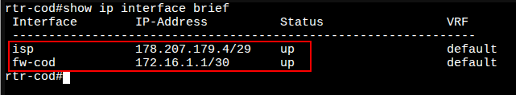

* Проверить созданные Service instance можно командой **show service-instance brief** из режима администрирования (**enable**):

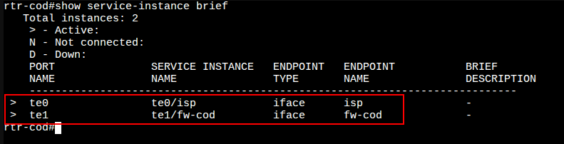

* IP-адрес шлюза по умолчанию на данном устройстве на текущий момент не задаётся (будет рассмотрено далее, в соответствующем разделе), т.к. по условиям задания:
  + *Маршрутизатор ЦОД должен получать маршрут по умолчанию по BGP*
    - *Ручное создание маршрута по умолчанию ЗАПРЕЩЕНО!*
* Но связность с Интернет провайдером **ISP**проверить стоит:

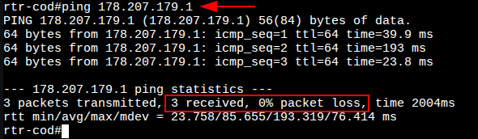

#### **rtr-a (ecorouter):**

##### Назначение имени на устройство:

* Реализация аналогично **rtr-cod**, за исключением соответствующего доменного имени:
  + имя устройства должно быть:

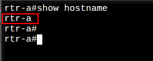

* + доменное имя на устройстве должно быть:

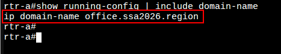

##### Назначение IP-адресов на устройство:

* Реализация аналогично **rtr-cod**, за исключением того, что на базе физического порта **te1** должны быть созданы интерфейсы и Service instance с целью обработки тегированного трафика для предоставления возможности маршрутизации между VLAN (рассмотрено далее)
  + должен быть создан интерфейс для подключения к Интернет провайдеру **ISP**:

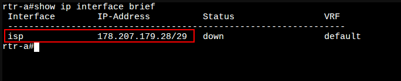

* + должен быть создан Service instance на порту **te0**
  + на созданный Service instance реализована обработка не тегированного трафика
  + в созданный Service instance добавлен интерфейс для подключения к Интернет провайдеру

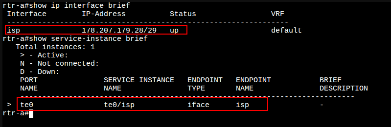

* В отличае от **rtr-cod**, на **rtr-a** по заданию нет никаких требований про настройку BGP, а значит для доступа в сеть Интернет, маршрут по умолчанию можно задать вручную:
  + переходим в режим конфигурации **(configure terminal)**
  + с помощью команды **ip route <IP\_NETWORK/PREFIX> <NEXTHOP\_IP\_ADDRESS>** задаём маршут по умолчанию (шлюз)

```bash
rtr-a(config)#ip route 0.0.0.0/0 178.207.179.25

rtr-a(config)#
```

* Проверить назначенный маршрут по умолчанию можно командой **show ip route static** из режима администрирования (**enable**):

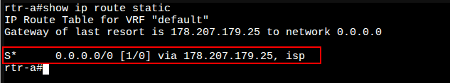

* Так же стоит проверить доступ в сеть Интернет:

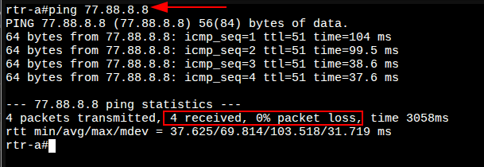

* Реализуем создание под-интерфейсов для дальнейшем маршрутизации между VLAN-ами:
> **vl100** — VLAN 100 (SRV), 172.20.10.0/24 | **vl200** — VLAN 200 (CLI), 172.20.20.0/24 | **vl300** — VLAN 300 (MGMT), 172.20.30.0/24

  + Создаём интерфейсы с произвольными именами для каждого VLAN-а и назначаем на них IP-адреса:

```bash
rtr-a(config)#interface vl100

rtr-a(config-if)#ip address 172.20.10.254/24

rtr-a(config-if)#description "VLAN - SRV"

rtr-a(config-if)#exit

rtr-a(config)#

rtr-a(config)#interface vl200

rtr-a(config-if)#ip address 172.20.20.254/24

rtr-a(config-if)#description "VLAN - CLI"

rtr-a(config-if)#exit

rtr-a(config)#

rtr-a(config)#interface vl300

rtr-a(config-if)#ip address 172.20.30.254/24

rtr-a(config-if)#description "VLAN - MGMT"

rtr-a(config-if)#exit

rtr-a(config)#
```

* Проверить назначенные IP-адреса на интерфейсы можно командой **show ip interface brief** из режима администрирования **(enable):**
  + созданные интрфейсы пока не добавлены в какие-либо **Service instance**, а значит не привязаны и к порту, отсюда и статус **down**

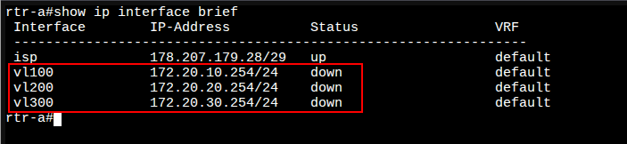

> **te1** — внутренний порт, обращён в сторону коммутаторов **sw1-a** / **sw2-a**

* + на базе физического интерфейса **te1** для каждого VLAN-а создаём **service-instance** с инкапсуляцией соответствующих тегов (**VID**) и подключением необходимых интерфейсов:

##### Пояснение к листингу команд указанному ниже

Операции над метками в сервисных интерфейсах:

* Есть три варианта операций над метками: **удаление** существующей метки/меток, **добавление** новой метки (меток) и **трансляция** метки/меток из одного значения в другое.

Пояснение команд:

* Указание номера, обрабатываемого VLAN выполняется на service-instance с помощью команды **encapsulation dot1q <VID> exact**
  + опция **exact** показывает, что под это правило попадут кадры только с меткой равной **<VID>**
  + слово **exact** писать не обязательно, так как это поведение по умолчанию и в выводе **show run** это слово не отображается
* Указание выполняемой операции выполняется на service-instance с помощью команды **rewrite pop <№>**
  + ключ **1** показывает, что снимаем только одну, верхнюю метку, на L3 кадр должен поступать без признаков VLAN

```bash
rtr-a(config)#port te1

rtr-a(config-port)#service-instance te1/vl100

rtr-a(config-service-instance)#encapsulation dot1q 100

rtr-a(config-service-instance)#rewrite pop 1

rtr-a(config-service-instance)#connect in

rtr-a(config-service-instance)#connect ip interface vl100                   

rtr-a(config-service-instance)#exit

rtr-a(config-port)#

rtr-a(config-port)#service-instance te1/vl200

rtr-a(config-service-instance)#encapsulation dot1q 200

rtr-a(config-service-instance)#rewrite pop 1

rtr-a(config-service-instance)#connect ip interface vl200 

rtr-a(config-service-instance)#exit

rtr-a(config-port)#

rtr-a(config-port)#service-instance te1/vl300

rtr-a(config-service-instance)#encapsulation dot1q 300

rtr-a(config-service-instance)#rewrite pop 1

rtr-a(config-service-instance)#connect ip interface vl300 

rtr-a(config-service-instance)#exit

rtr-a(config-port)#exit

rtr-a(config)#write memory

Building configuration...


rtr-a(config)#
```

* Проверить назначенные IP-адреса на интерфейсы можно командой **show ip interface brief** из режима администрирования **(enable):**

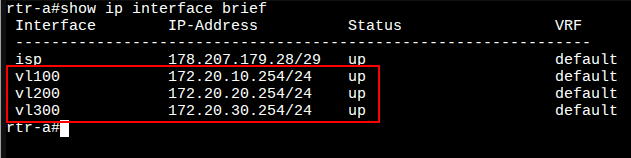

* Проверить созданные Service instance можно командой **show service-instance brief** из режима администрирования (**enable**):

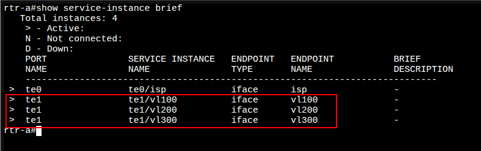

Последнее изменение: понедельник, 10 ноября 2025, 17:15