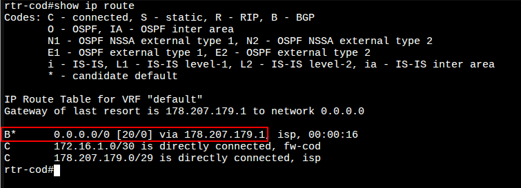
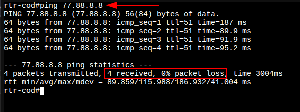

# 3. Настройка маршрутизации BGP на rtr-cod

### Вариант реализации:

#### 

#### rtr-cod (ecorouter):

##### Базовая настройка BGP:

* Запустите протокол BGP, указав нужную автономную систему, командой: **router bgp <№>**:

```bash
rtr-cod(config)#router  bgp 64500
rtr-cod(config-router)#
```

* Указать уникальный идентификатор маршрутизатора в протоколе BGP, командой: **bgp router-id <IP>**:

```bash
rtr-cod(config-router)#bgp router-id 178.207.179.4
rtr-cod(config-router)#
```

* Сконфигурируйте BGP соседство c Интернет провайдером **ISP**, указав адрес соседа и номер локальной AS, используя команду: **neighbor <NEIGHBOR\_IP> remote-as <$>**:

```bash
rtr-cod(config-router)#neighbor 178.207.179.1 remote-as 31133
rtr-cod(config-router)#exit
rtr-cod(config)#write memory
Building configuration...

rtr-cod(config)#
```

* Проверить состояние всех соединений BGP можно командой **show ip bgp summary** из режима администрирования (**enable**):


* Также по условиям задания **rtr-cod** должен получать маршрут по умолчанию по BGP
* Проверить маршрут по умолчанию можно командой **show ip route** из режима администрирования (**enable**):



* Проверить доступ в сеть Интернет:



Последнее изменение: понедельник, 10 ноября 2025, 17:12