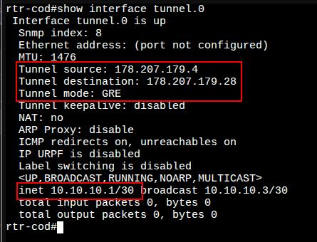
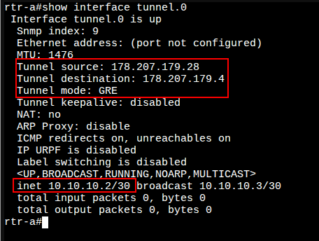

# 4. Настройка туннелей между офисом «а» и «cod»

### Вариант реализации:

#### 

#### rtr-cod (ecorouter):

##### Настройка туннеля GRE между устройствами:

* Создайте интерфейс туннеля c именем **tunnel.0**:

```bash
rtr-cod(config)#interface tunnel.0
rtr-cod(config-if-tunnel)#
```

* Назначьте ip адрес в соответствие с требования задания:

```bash
rtr-cod(config-if-tunnel)#ip address 10.10.10.1/30
rtr-cod(config-if-tunnel)#
```

* Задайте режим работы туннеля GRE и адресов начала (источника - **rtr-cod**) и конца туннеля (назначения - **rtr-a**):

```bash
rtr-cod(config-if-tunnel)#ip tunnel 178.207.179.4 178.207.179.28 mode gre
rtr-cod(config-if-tunnel)# exit
rtr-cod(config)#write memory
Building configuration...

rtr-cod(config)#
```

* Для просмотра состояния туннеля используется команда **show interface tunnel.0** из режима администрирования (**enable**):



#### **rtr-a (ecorouter):**

##### Настройка туннеля GRE между устройствами:

* Реализация аналогично **rtr-cod**, за исключением соответствующего IP-адресов **источника** и **назначения**:
  + состояния туннеля должно быть:



* Должна быть связность по туннелю:


Последнее изменение: понедельник, 10 ноября 2025, 17:13