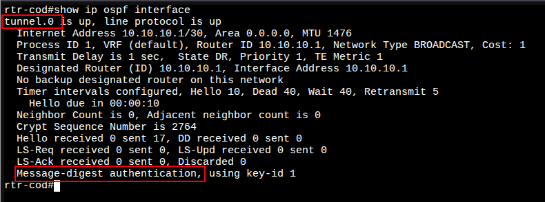
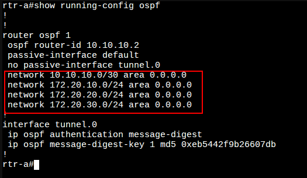
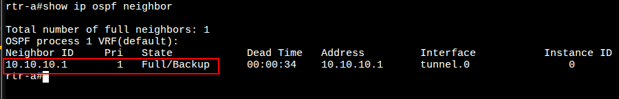
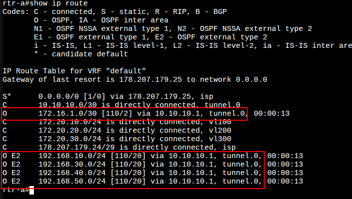
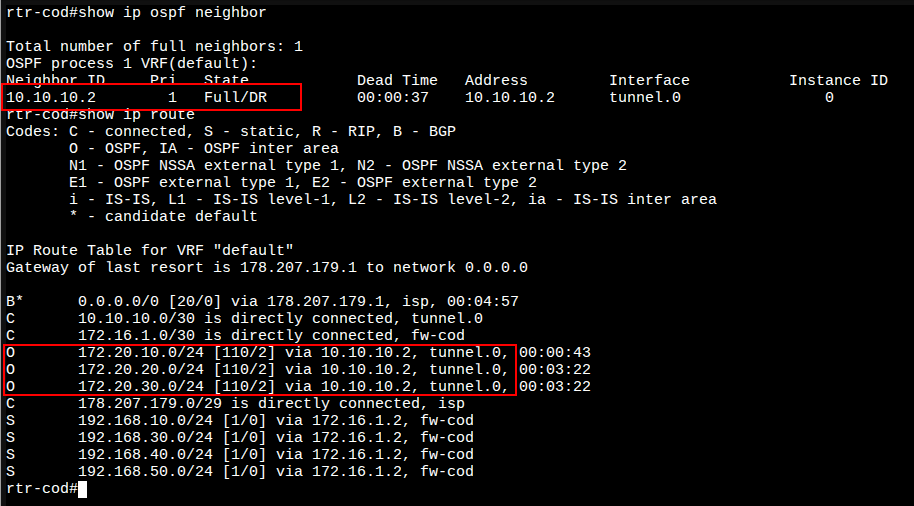
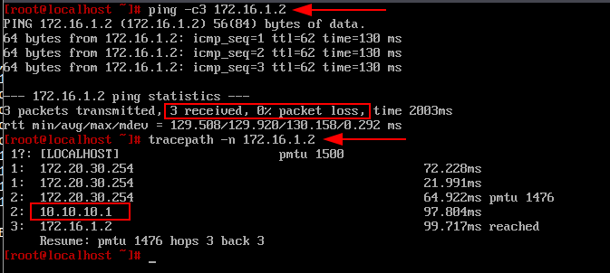

# 6. Настройка динамической маршрутизации между офисом «a» и «cod»

### Вариант реализации:

#### 

#### rtr-cod (ecorouter):

##### Настройка динамической маршрутизации OSPF:

* Перейдите в режим конфигурирования протокола с помощью команды **router ospf <номер процесса>**, где номер в пределах <0-65535> в режиме глобальной конфигурации:

```bash
rtr-cod(config)#router ospf 1
rtr-cod(config-router)#
```

* Сконфигурируйте OSPF идентификатор маршрутизатора (необязательный этап)
  + Используйте команду **ospf router-id <значение>,** в качестве значения укажем туннельный IP-адрес маршрутизатора:

```bash
rtr-cod(config-router)#router-id 10.10.10.1
rtr-cod(config-router)#
```

* Переводим все интерфейсы в пассивный режим:

```bash
rtr-cod(config-router)#passive-interface default 
rtr-cod(config-router)#
```

* Исключаем интерфейс **tunnel.0** из пассивного режима для установления соседства и дальнейшего обмена маршрутной информацией:

```bash
rtr-cod(config-router)#no passive-interface tunnel.0 
rtr-cod(config-router)#
```

* Объявляем сети, которые будут задействованы в процессе маршрутизации:
  + импортировав (**redistribute**) ранее указанные статические маршруты (до локальных сетей COD-а) в процесс OSPF

```bash
rtr-cod(config-router)#redistribute static 
rtr-cod(config-router)#network 10.10.10.0/30 area 0
rtr-cod(config-router)#network 172.16.1.0/30 area 0
rtr-cod(config-router)#exit
rtr-cod(config)#
```

* Обеспечиваем защиту протокола маршрутизации посредством парольной защиты:

```bash
rtr-cod(config)#interface tunnel.0
rtr-cod(config-if-tunnel)#ip ospf authentication message-digest 
rtr-cod(config-if-tunnel)#ip ospf message-digest-key 1 md5 P@ssw0rd
rtr-cod(config-if-tunnel)#exit
rtr-cod(config)#write memory
Building configuration...

rtr-cod(config)#
```

* Просмотр данных о состоянии и сконфигурированных настройках на интерфейсах, участвующих в OSPF процессе можно командой **show ip ospf interface** из режима администрирования **(enable):**



#### **rtr-a (ecorouter):**

##### Настройка динамической маршрутизации OSPF:

* Реализация аналогично **rtr-cod**, за исключением:
  + должны быть указаны следующие сети:



* Просмотр сведений о соседских отношениях между OSPF маршрутизаторами можно командой **show ip ospf neighbor** из режима администрирования **(enable):**



* Проверить таблицу маршрутизации можно командой **show ip route** из режима администрирования **(enable):**



* Аналогично на **rtr-cod**:



* Также можно проверить связность между **sw1-a** и **fw-cod**:
  + если ранее указанный временный маршрут по умолчанию на **fw-cod** всё ещё присутствует,
  + а на **sw1-a** ранее указанный временный IP-адрес присутствует



Последнее изменение: вторник, 11 ноября 2025, 17:21