# 10. Настройка коммутации между sw1-cod и sw2-cod

### Вариант реализации:

#### 

#### sw1-cod (alt-server):

##### Назначение имени на устройство:

* Для назначения имени устройства согласно топологии используем следующую команду:

```bash
hostnamectl set-hostname sw1-cod.cod.ssa2026.region; exec bash
```

* Так же рекомендуется указать имя в файле **/etc/sysconfig/network**:

```bash
vim /etc/sysconfig/network
```

* + указать имя в параметре **HOSTNAME**:

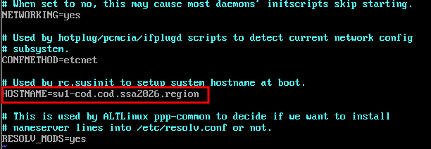

* Проверить можно с помощью команды **hostname** с ключём **-f**:

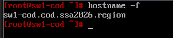

#### cli1-a (alt-workstation):

##### Настройка авторизации на fw-cod для доступа в сеть Интернет:

* Авторизация - необходимое условие для доступа пользователя в интернет. Для работы в пределах локальной сети авторизация не требуется
* Для доступа сетевого устройства (хоста) в интернет через NGFW Novum с возможностью контроля трафика, хост должен быть авторизован в системе под учетной записью пользователя
* Открываем браузер и переходи по **[https://172.16.1.2:8443](https://172.16.1.2:8443/)** (IP-адрес **fw-cod**), выполняем вход в веб-интерфейс управления **fw-cod**
* Для авторизации необходимо создать пользователя, для этого перейдём в **Пользователи -> Учётные записи** и нажмём **Добавить пользователя**:

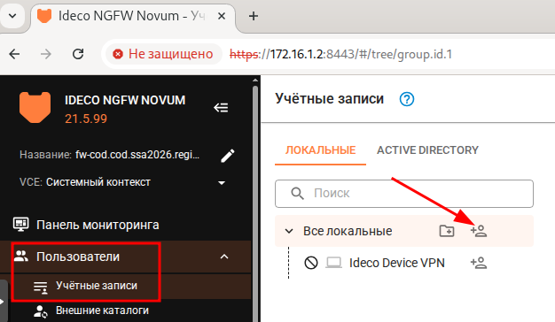

* В форме **Добавления пользователя** заполняем только **Имя пользователя** (произвольное) и **Логин** (произвольный)
  + пароль можно оставить сгенерированный случайным образом, он нам не потребуется

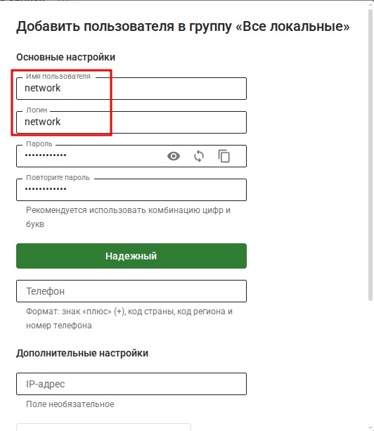

* Результат успешного добавления пользователя:

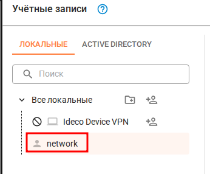

* Далее перейдёт в **Пользователи -> Авторизация -> ПО ПОДСЕТЯД** и нажмём **Добавить**:

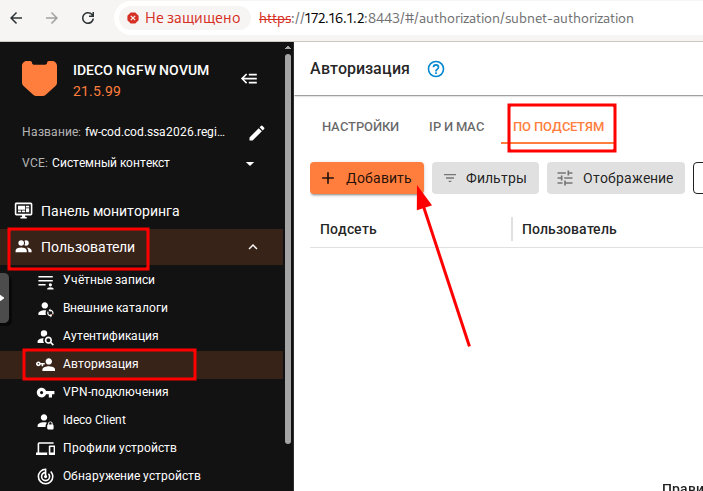

* В форме **Добавление правила авторизации** указываем только что созданного пользователя и **подсеть**
  + в данном случае в сеть **192.168.0.0/16**входят все подсети **COD-а** (именно 192.168.10.0/24, 192.168.20.0/24, 192.168.30.0/24, 192.168.40.0/24, 192.168.50.0/24);

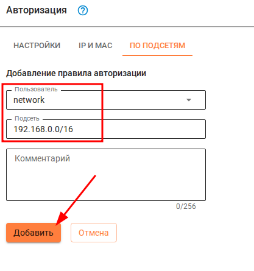

* Результат успешного добавления Авторизации по подсетям:

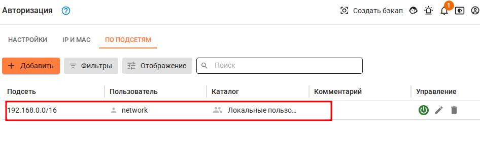

##### Настройка коммутации:

* Проверяем интерфейсы и определяемся какой к кому направлен (сверка производится по МАС-адресам):
  + таким образом, имеем (в данном конкретном случае):
    - **ens19** - интерфейс в сторону **fw-cod**;
    - **ens21** - интерфейс в сторону **sw2-cod;**
    - **ens22** - интерфейс в сторону **sw2-cod;**
    - **enp2s1** - интерфейс в сторону **srv2-cod;**
    - **enp2s29** - интерфейс в сторону **admin-cod;**
    - **enp3s12** - интерфейс в сторону **srv2-cod**

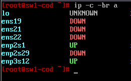

* Для каждого интерфейса необходимо создать директорию по пути **/etc/net/ifaces/** с помощью команды **mkdir**:

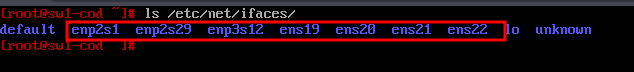

* Для каждого интерфейса в директории **/etc/net/ifaces/ <ИМЯ\_ИНТЕРФЕЙСА>/** необходимо создать файл **options**
  + указав в нём два основных параметра:
    - **TYPE=eth**
    - **BOOTPROTO=static**
  + после чего необходимо перезагрузить службу **network**
  + все интерфейсы должны перейти в статус **UP:**

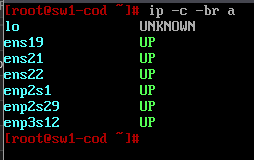

* Временно на базе интерфейса в сторону **fw-cod** создадим подинтерфейс с указанием **vlan300** для дальнейшей установки пакета **openvswitch**:

```bash
ip link add link ens19 name ens19.300 type vlan id 300

ip link set dev ens19.300 up

ip addr add 192.168.30.1/24 dev ens19.300

ip route add 0.0.0.0/0 via 192.168.30.254

echo "nameserver 77.88.8.8" > /etc/resolv.conf
```

* Почле чего обновляем список пакетов и устанавливаем **openvswitch**:

```bash
apt-get update && apt-get install -y openvswitch
```

* Включаем и добавляем в автозагрузку **openvswitch**:

```bash
systemctl enable --now openvswitch
```

* Правим основной файл **options** в котором по умолчанию сказано:
  + удалять настройки заданые через **ovs-vsctl,**
  + т.к. через **etcnet** будет выполнено только создание интерфейса типа **internal**
  + с назначением необходимого IP-адреса, а настройка коммутации будет выполнена средствами **openvswitch**

```bash
sed -i "s/OVS_REMOVE=yes/OVS_REMOVE=no/g" /etc/net/ifaces/default/options
```

* Перезагрузить сервер - будет быстрее чем удалять параметры заданые в ручную через пакет **iproute2**:

```bash
reboot
```

* Чтобы на **sw2-cod** была возможность установить пакет **openvswitch**:
  + временно сосдадим простой коммутатор с именем, например **br0**
  + и добавим в него интерфейсы **ens19** в сторону **fw-cod** и **ens21** в сторону **sw2-cod**

```bash
ovs-vsctl add-br br0
```

```bash
ovs-vsctl add-port br0 ens19
```

```bash
ovs-vsctl add-port br0 ens21
```

#### sw2-cod (alt-server):

##### Назначение имени на устройство:

* Реализация аналогично **sw1-cod**:

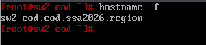

* Для установки пакета ****openvswitch****необходим доступ в сеть Интернет, для этого необходимо на виртуальной машине **sw2-cod**:
  + назначив средствами **iproute2** временно на интерфейс,смотрящий в сторону **sw1-cod (ens19)**,
  + тегированный подинтерфейс с IP-адресом из подсети для **vlan300**, а также шлюзом по умолчанию и DNS

```bash
ip link add link ens19 name ens19.300 type vlan id 300

ip link set up ens19

ip link set up ens19.300

ip addr add 192.168.30.2/24 dev ens19.300

ip route add 0.0.0.0/0 via 192.168.30.254

echo "nameserver 77.88.8.8" > /etc/resolv.conf
```

* Почле чего обновляем список пакетов и устанавливаем **openvswitch**:

```bash
apt-get update && apt-get install -y openvswitch
```

* Включаем и добавляем в автозагрузку **openvswitch**:

```bash
systemctl enable --now openvswitch
```

* Правим основной файл **options** в котором по умолчанию сказано:
  + удалять настройки заданые через **ovs-vsctl,**
  + т.к. через **etcnet** будет выполнено только создание интерфейса типа **internal**
  + с назначением необходимого IP-адреса, а настройка коммутации будет выполнена средствами **openvswitch**

```bash
sed -i "s/OVS_REMOVE=yes/OVS_REMOVE=no/g" /etc/net/ifaces/default/options
```

* Перезагрузить сервер - будет быстрее чем удалять параметры заданые в ручную через пакет **iproute2**:

```bash
reboot
```

#### sw1-cod (alt-server):

##### Настройка коммутации:

* Удаляем ранее созанный временный коммутатор с именем **br0**:

```bash
ovs-vsctl del-br br0
```

* Создадим коммутатор с именем **sw1-cod**:

```bash
ovs-vsctl add-br sw1-cod
```

* Проверить создание коммутатора можно с помощью команды **ovs-vsctl show**:

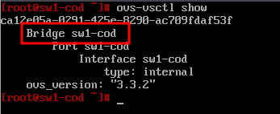

* Добавим интерфейс, направленный в сторону **admin-cod** (enp2s29) в созданный коммутатор и назначим его в качестве порта доступа (access), указав принадлежность к **VLAN 300**:

```bash
ovs-vsctl add-port sw1-cod enp2s29 tag=300
```

* Добавим интерфейс, направленный в сторону **srv2-cod** (enp2s1) в созданный коммутатор и назначим его в качестве порта доступа (access), указав принадлежность к **VLAN 100**:

```bash
ovs-vsctl add-port sw1-cod enp2s1 tag=100
```

* Добавим интерфейс, направленный в сторону **srv2-cod** (enp3s12) в созданный коммутатор и назначим его в качестве порта доступа (access), указав принадлежность к **VLAN 200**:

```bash
ovs-vsctl add-port sw1-cod enp3s12 tag=200
```

* Интерфейс в сторону **fw-cod** (ens19) добавляем в созданный коммутатор, но настраиваем как магистральный (trunk) порт:
  + также разрешаем пропуск только требуемых VLAN (100,200,300,400 и 500)

```bash
ovs-vsctl add-port sw1-cod ens19 trunk=100,200,300,400,500
```

* Проверить добавление портов в коммутатор можно с помощью команды **ovs-vsctl show**:

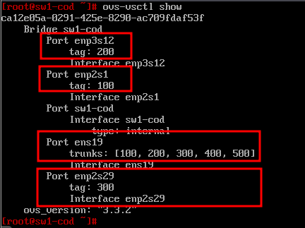

* Включаем модуль ядра отвечающий за тегированный трафик (**802.1Q**):

```bash
modprobe 8021q
```

```bash
echo "8021q" | tee -a /etc/modules
```

* На базе интерфейсов **ens21** и **ens22**, направленных в сторону **sw2-cod**, создадим **bond**-интерфейс в режиме **active-backup**:

```bash
ovs-vsctl add-bond sw1-cod bond0 ens21 ens22 bond_mode=active-backup
```

* Интерфейс типо **bond** в сторону **sw2-cod** (**bond0**) настраиваем как магистральный (trunk) порт:
  + также разрешаем пропуск только требуемых VLAN (100,200,300,400 и 500)

```bash
ovs-vsctl set port bond0 trunk=100,200,300,400,500
```

* Проверить можно с помощью команды **ovs-vsctl show**:

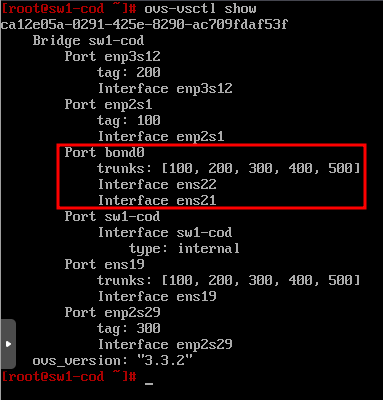

* Режим работы **bond** интерфейса проверить можно с помощью команды **ovs-appctl bond/show**:

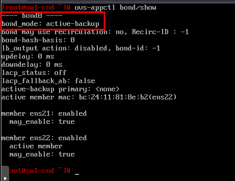

* Сетевая подсистема **etcnet** будет взаимодействовать с **openvswitch**, для того чтобы корректно можно было назначить  IP-адрес на  интерфейс управления  
  + создаём каталог для management интерфейса с именем **mgmt-cod**:

```bash
mkdir /etc/net/ifaces/mgmt-cod
```

* Описываем файл **options** для создания management интерфейса с именем **mgm-codt**:

```bash
vim /etc/net/ifaces/mgmt-cod/options
```

* + где:
    - **TYPE** - тип интерфейса (**internal**);
    - **BOOTPROTO** - определяет как будут назначаться сетевые параметры (статически);
    - **CONFIG\_IPV4** - определяет использовать конфигурацию протокола IPv4 или нет;
    - **BRIDGE** - определяет к какому мосту необходимо добавить данный интерфейс;
    - **VID** - определяет принадлежность интерфейса к VLAN;

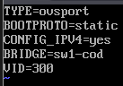

* Назначаем IP-адрес и шлюз на созданный интерфейс **mgmt**:

```bash
echo "192.168.30.1/24" > /etc/net/ifaces/mgmt-cod/ipv4address
```

```bash
echo "default via 192.168.30.254" > /etc/net/ifaces/mgmt-cod/ipv4route
```

* Для применения настроек, необходимо перезагрузить службу **network**:

```bash
systemctl restart network
```

* Проверить назначенный IP-адрес можно командой **ip a**:

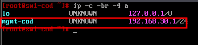

* Проверить назначенный IP-адрес шлюза по умолчанию можно команжой **ip r**:

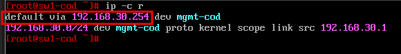

* Также стоит с помощью команды **ovs-vsctl show** проверить, что данный интерфейс добавился в коммутатор **sw1-cod**:

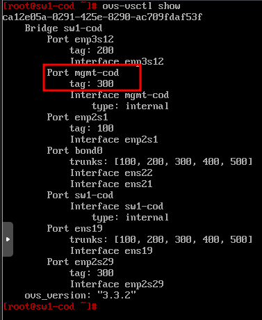

* Помимо того, что интерфейс **mgmt-cod** является портом доступа (access) необходимо использовать NativeVLAN:

```bash
ovs-vsctl set port mgmt-cod vlan_mode=native-untagged
```

* Проверить можно с помощью команды **ovs-vsctl list port mgmt-cod:**

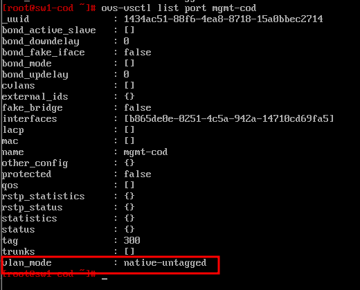

#### sw2-cod (alt-server):

* Проверяем интерфейсы и определяемся какой к кому направлен:
  + таким образом, имеем (в данном конкретном случае):
    - **ens19** - интерфейс в сторону **sw1-cod**;
    - **ens20** - интерфейс в сторону **sw1-cod**;
    - **ens21** - интерфейс в сторону **srv1-cod**;
    - **ens22** - интерфейс в сторону **srv1-cod**;
    - **enp2s29** - интерфейс в сторону **sip-cod**;
    - **enp3s12** - интерфейс в сторону **cli-cod**;

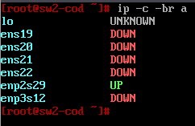

* Для каждого интерфейса в директории **/etc/net/ifaces/ <ИМЯ\_ИНТЕРФЕЙСА>/** необходимо создать файл **options**
  + указав в нём два основных параметра:
    - **TYPE=eth**
    - **BOOTPROTO=static**
  + после чего необходимо перезагрузить службу **network**
  + все интерфейсы должны перейти в статус **UP:**


* Создадим коммутатор с именем **sw2-cod**:

```bash
ovs-vsctl add-br sw2-cod
```

* Проверить создание коммутатора можно с помощью команды **ovs-vsctl show**:

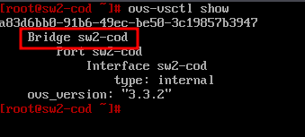

* Добавим интерфейс, направленный в сторону **srv1-cod** (ens21) в созданный коммутатор и назначим его в качестве порта доступа (access), указав принадлежность к **VLAN 100**:

```bash
ovs-vsctl add-port sw2-cod ens21 tag=100
```

* Добавим интерфейс, направленный в сторону **srv1-cod** (ens22) в созданный коммутатор и назначим его в качестве порта доступа (access), указав принадлежность к **VLAN 200**:

```bash
ovs-vsctl add-port sw2-cod ens22 tag=200
```

* Добавим интерфейс, направленный в сторону **sip-cod** (enp2s29) в созданный коммутатор и назначим его в качестве порта доступа (access), указав принадлежность к **VLAN 500**:

```bash
ovs-vsctl add-port sw2-cod enp2s29 tag=500
```

* Добавим интерфейс, направленный в сторону **cli-cod** (enp3s12) в созданный коммутатор и назначим его в качестве порта доступа (access), указав принадлежность к **VLAN 400**:

```bash
ovs-vsctl add-port sw2-cod enp3s12 tag=400
```

* Проверить добавление портов в коммутатор можно с помощью команды **ovs-vsctl show**:

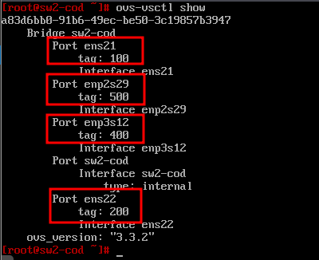

* Включаем модуль ядра отвечающий за тегированный трафик (**802.1Q**):

```bash
modprobe 8021q
```

```bash
echo "8021q" | tee -a /etc/modules
```

* На базе интерфейсов **ens19** и **ens20**, направленных в сторону **sw1-cod**, создадим **bond**-интерфейс в режиме **active-backup**:

```bash
ovs-vsctl add-bond sw2-cod bond0 ens19 ens20 bond_mode=active-backup
```

* Интерфейс типо **bond** в сторону **sw2-cod** (**bond0**) настраиваем как магистральный (trunk) порт:
  + также разрешаем пропуск только требуемых VLAN (100,200,300,400 и 500)

```bash
ovs-vsctl set port bond0 trunk=100,200,300,400,500
```

* Проверить можно с помощью команды **ovs-vsctl show**:

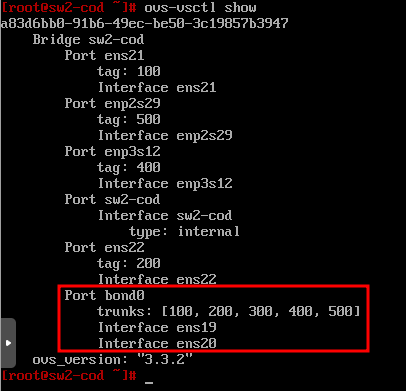

* Режим работы **bond** интерфейса проверить можно с помощью команды **ovs-appctl bond/show**:

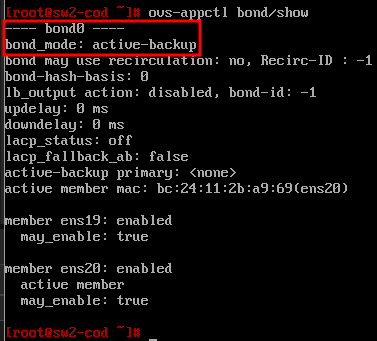

* Сетевая подсистема **etcnet** будет взаимодействовать с **openvswitch**, для того чтобы корректно можно было назначить  IP-адрес на  интерфейс управления  
  + создаём каталог для management интерфейса с именем **mgmt-cod**:

```bash
mkdir /etc/net/ifaces/mgmt-cod
```

* Описываем файл **options** для создания management интерфейса с именем **mgm-codt**:

```bash
vim /etc/net/ifaces/mgmt-cod/options
```

* + где:
    - **TYPE** - тип интерфейса (**internal**);
    - **BOOTPROTO** - определяет как будут назначаться сетевые параметры (статически);
    - **CONFIG\_IPV4** - определяет использовать конфигурацию протокола IPv4 или нет;
    - **BRIDGE** - определяет к какому мосту необходимо добавить данный интерфейс;
    - **VID** - определяет принадлежность интерфейса к VLAN;

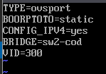

* Назначаем IP-адрес и шлюз на созданный интерфейс **mgmt**:

```bash
echo "192.168.30.2/24" > /etc/net/ifaces/mgmt-cod/ipv4address
```

```bash
echo "default via 192.168.30.254" > /etc/net/ifaces/mgmt-cod/ipv4route
```

* Для применения настроек, необходимо перезагрузить службу **network**:

```bash
systemctl restart network
```

* Проверить назначенный IP-адрес можно командой **ip a**:

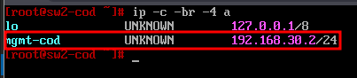

* Проверить назначенный IP-адрес шлюза по умолчанию можно команжой **ip r**:


* Также стоит с помощью команды **ovs-vsctl show** проверить, что данный интерфейс добавился в коммутатор **sw1-cod**:


* Помимо того, что интерфейс **mgmt-cod** является портом доступа (access) необходимо использовать NativeVLAN:

```bash
ovs-vsctl set port mgmt-cod vlan_mode=native-untagged
```

* Проверить можно с помощью команды **ovs-vsctl list port mgmt-cod:**


Последнее изменение: пятница, 14 ноября 2025, 12:56