# 11. Настройка имён и IP-адресов на всех остальных устройствах

### Вариант реализации:

#### 

#### cli-cod (alt-workstation):

##### Базовая настройка устройства:

* Перейдём в Центр Управления Системой (ЦУС/acc):

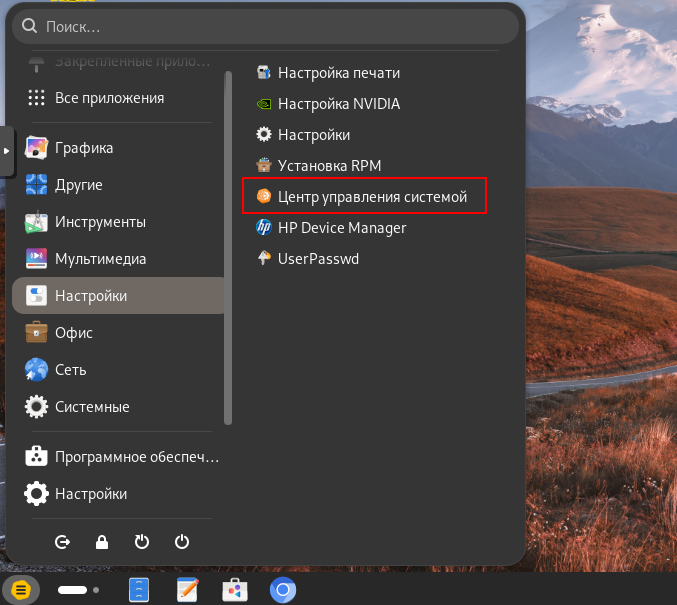

* В ЦУС перейдём в раздел Ethernet-интерфейсы:

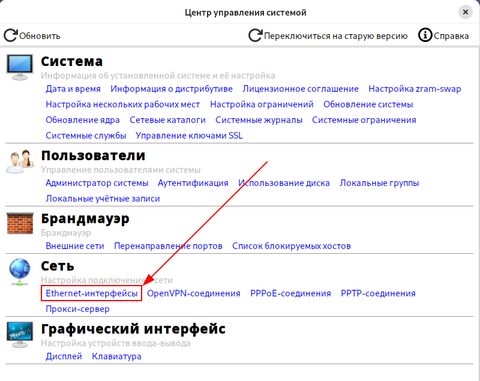

* Назначим имя на устройство в соответствие с топологией:

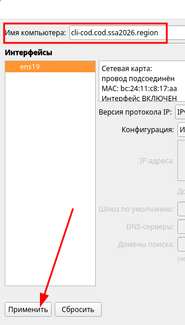

* В качестве режима работы сетевой подсистемы выберем **NetworkManager (native)**:

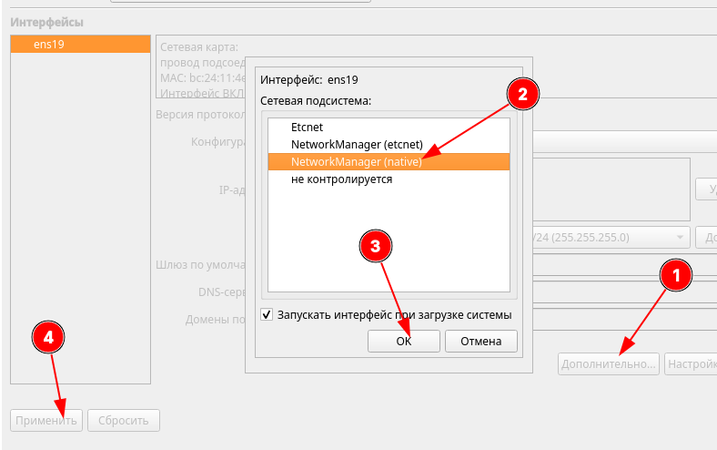

* Перейдём в обычный **Настройки** для назначения сетевых параметров:

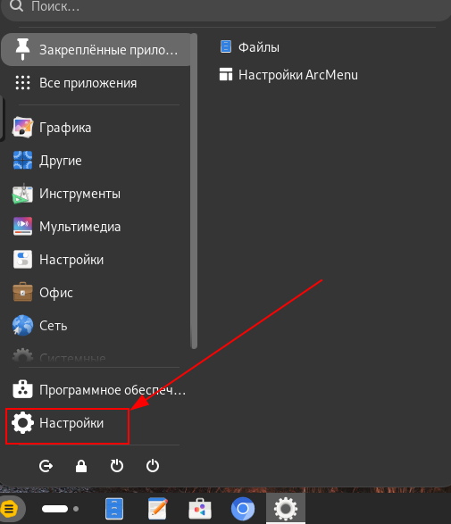

* В разделе **Сеть** перейдём к настройке сетевого подключения:

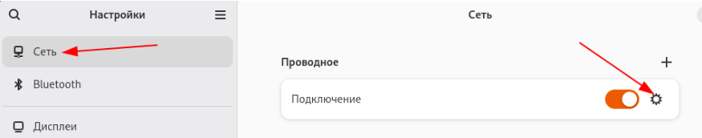

* Задаём **Вручную** и нажимаем **Применить**:
  + **Адрес**
  + **Маску сети**
  + **Шлюз**
  + **DNS** (в качестве DNS-сервера указываем IP-адрес **srv1-cod**)

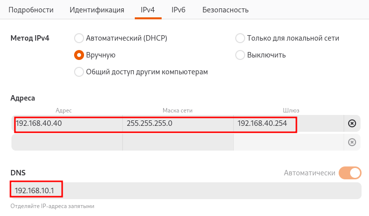

* Проверить можно на вкладке **Подробности:**

**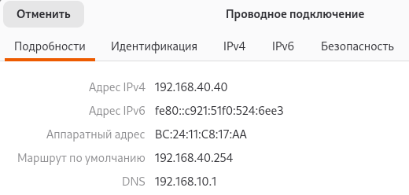**

* Также можно проверить доступ в сеть Интернет:

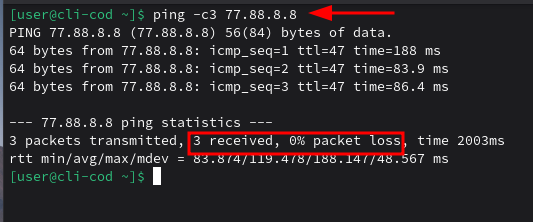

#### cli2-a (alt-workstation):

##### Базовая настройка устройства:

* Реализация аналогично **cli-cod**:
  + имя должно быть:

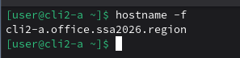

* + сетевые параметры должны быть:

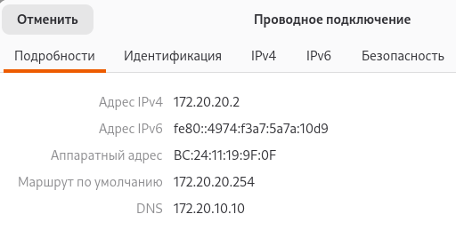

* + доступ в сеть Интернет должен быть:

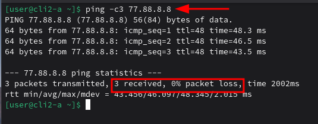

* + связность с устройствами **COD-а**должна быть, например с **cli-cod:**

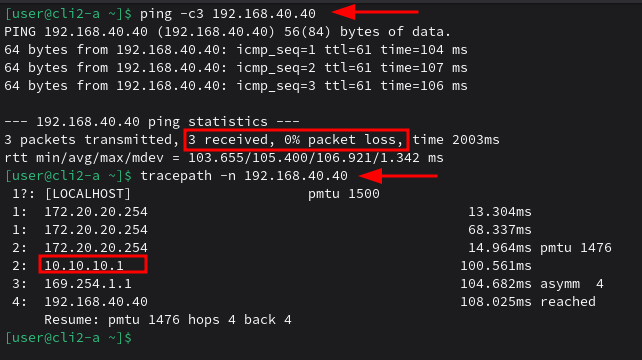

#### admin-cod (alt-workstation):

##### Базовая настройка устройства:

* Реализация аналогично **cli-cod**:


#### srv1-cod (alt-server):

##### Базовая настройка устройства:

* Для назначения имени устройства согласно топологии используем следующую команду:

```bash
hostnamectl set-hostname srv1-cod.cod.ssa2026.region; exec bash
```

* Так же рекомендуется указать имя в файле **/etc/sysconfig/network**:

```bash
vim /etc/sysconfig/network
```

* + указать имя в параметре **HOSTNAME**:

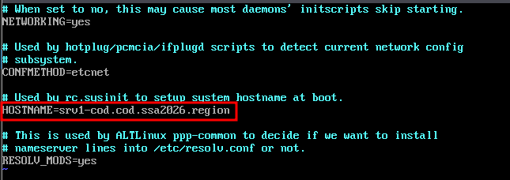

* Проверить можно с помощью команды **hostname** с ключём **-f**:

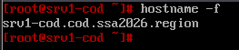

Проверяем интерфейсы и определяемся какой к кому направлен (сверка производится по МАС-адресам):

* таким образом, имеем (в данном конкретном случае):
  + **ens19** - интерфейс в сторону **sw2-cod (vlan100)**;
  + **ens21** - интерфейс в сторону **sw2-cod (vlan200);**

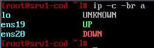

Для каждого интерфейса в директории **/etc/net/ifaces/ <ИМЯ\_ИНТЕРФЕЙСА>/** необходимо создать файл **options**

* указав в нём два основных параметра:
  + **TYPE=eth**
  + **BOOTPROTO=static**

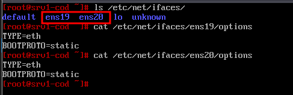

* Задаём IP-адрес на интерфейс **ens19 (vlan100)**:

```bash
echo "192.168.10.1/24" > /etc/net/ifaces/ens19/ipv4address
```

* Задаём IP-адрес шлюза по умолчанию для интерфейса **ens19 (vlan100)**:

```bash
echo "default via 192.168.10.254" > /etc/net/ifaces/ens19/ipv4route
```

* Задаём IP-адрес на интерфейс **ens20 (vlan200)**:
  + шлюз не задаётся, по заданию данный vlan не должен маршрутизироваться;

```bash
echo "192.168.20.1/24" > /etc/net/ifaces/ens20/ipv4address
```

* Перезагружаем службу **network** для применения всех настроек:

```bash
systemctl restart network
```

* Проверить:

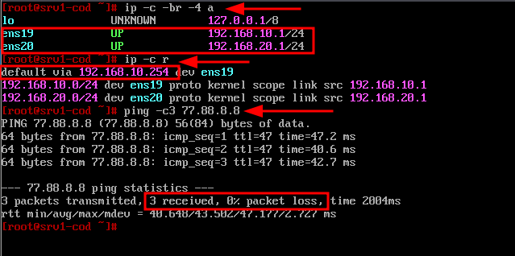

#### srv2-cod (alt-server):

##### Базовая настройка устройства:

* Реализация аналогично **srv1-cod**:


#### dc-a (alt-server):

##### Базовая настройка устройства:

* Реализация аналогично **srv1-cod**:


Последнее изменение: пятница, 14 ноября 2025, 13:39