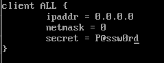
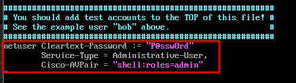
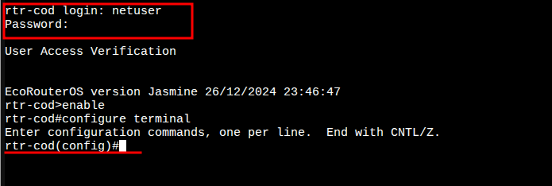
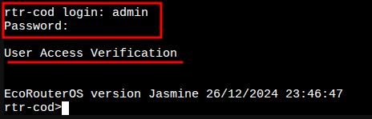
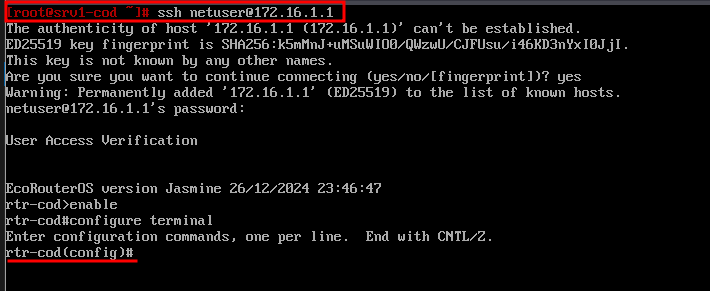
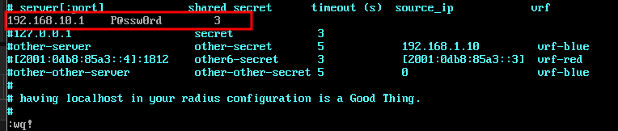
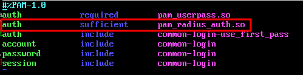
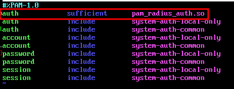
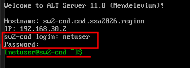
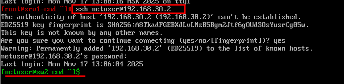

# 12. Настройка административного доступа (RADIUS)

### Вариант реализации:

#### 

#### srv1-cod (alt-server):

* Временно для возможности установки необходимых пакетов зададим публичный DNS-сервер:

```bash
echo "nameserver 77.88.8.8" > /etc/resolv.conf
```

* Устанавливаем пакеты **freeradius** и **freeradius-utils**:

```bash
apt-get update && apt-get install -y freeradius freeradius-utils
```

* Включаем службу **radiusd** в автозагрузку и запускаем ее:

```bash
systemctl enable --now radiusd
```

* Создаем клиентов добавляя в файле **/etc/raddb/clients.conf** следующее содержимое:

  + пример конфигурации файла **/etc/raddb/clients.conf** для любого клиента



* Редактируем файл с пользователями **/etc/raddb/users** добавляя в самый конец следующее содержимое:



* Перезапускаем службу **radiusd**:

```bash
systemctl restart radiusd
```

#### rtr-cod (ecorouter):

* Выполняем подключение к RADIUS-серверу:

```bash
rtr-cod(config)#security none 
rtr-cod(config)#aaa radius-server 192.168.10.1 port 1812 secret P@ssw0rd auth
rtr-cod(config)#
```

* Задаём приоритет:

```bash
rtr-cod(config)#aaa precedence local radius
rtr-cod(config)#write memory
Building configuration...

rtr-cod(config)#
```

* Проверить возможность входа из-под пользователя **netuser** с паролем **P@ssw0rd**:



* Проверить вход под локальной учетной записью даже при доступности RADIUS-сервера:



* Проверить доступ по **SSH** из-под пользователя **netuser** с паролем **P@ssw0rd**:
  + например с **srv1-cod**



#### sw1-cod и sw2-cod (alt-server):

* Временно для возможности установки необходимых пакетов зададим публичный DNS-сервер:

```bash
echo "nameserver 77.88.8.8" > /etc/resolv.conf
```

* Устанавливаем пакет **pam\_radius**:

```bash
apt-get update && apt-get install -y pam_radius
```

* Редактируем конфигурационный файл **/etc/pam\_radius\_auth.conf**:



* Редактируем конфигурационный файл **/etc/pam.d/sshd**:



* Редактируем конфигурационный файл **/etc/pam.d/system-auth-local**:



* Также в случае с **Linux**, данного пользователя необходимо создать локально:

```bash
useradd netuser
```

* Проверить возможность входа из-под пользователя **netuser** с паролем **P@ssw0rd**:



* Проверить доступ по **SSH** из-под пользователя **netuser** с паролем **P@ssw0rd**:
  + например с **srv1-cod**



Последнее изменение: понедельник, 17 ноября 2025, 13:01