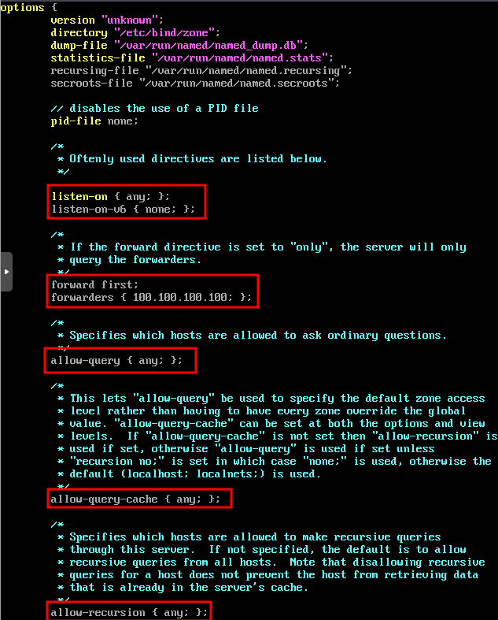
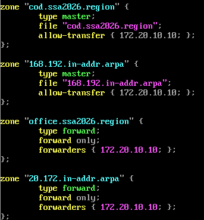
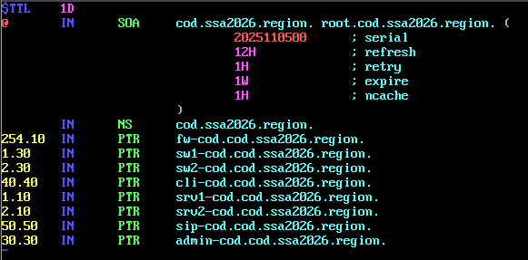
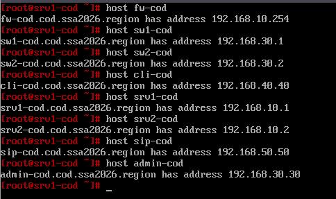
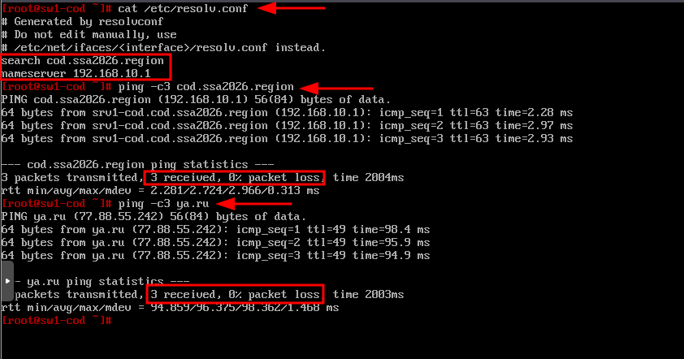
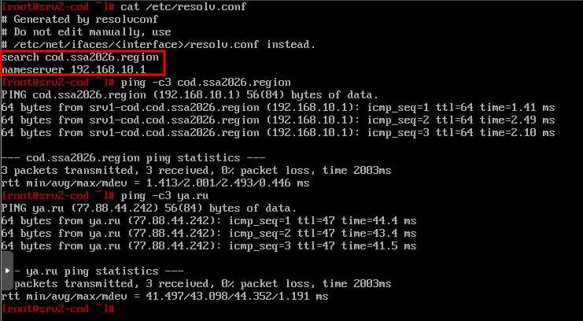

# 14. Настройка службы доменных имен в COD-е

### Вариант реализации:

#### 

#### srv1-cod (alt-server):

* Установим пакет **bind** и **bind-utils**:

```bash
apt-get install -y bind bind-utils
```

* Отредактируем конфигурационный файл **/etc/bind/options.conf**:



* Добавить в конфигурационный файл **/etc/bind/rfc1912.local** информацию о файлах зон прямого и обратного просмотра:



* Скопировать файл шаблона для зоны прямого просмотра:

```bash
cp /etc/bind/zone/localhost /etc/bind/zone/cod.ssa2026.region
```

* Выдать права на файл зоны прямого просмотра:

```bash
chown root:named /etc/bind/zone/cod.ssa2026.region
```

* Привести файл **/etc/bind/zone/cod.ssa2026.region** зоны прямого просмотра к следующему виду:


* Скопировать файл шаблона для зоны обратного просмотра:

```bash
cp /etc/bind/zone/localhost /etc/bind/zone/168.192.in-addr.arpa
```

* Выдать права на файл зоны прямого просмотра:

```bash
chown root:named /etc/bind/zone/168.192.in-addr.arpa
```

* Привести файл **/etc/bind/zone/168.192.in-addr.arpa** зоны обратного просмотра к следующему виду:



* Включить и добавить в автозагрузку службу **bind**:

```bash
systemctl enable --now bind
```

* Задаём DNS-сервер и домен поиска:

```bash
cat <<EOF > /etc/net/ifaces/ens19/resolv.conf
  search cod.ssa2026.region
  nameserver 127.0.0.1
EOF
```

* Перезагружаем сервер:

```bash
reboot
```

* Проверяем записи типа **А**:



* Проверяем записи типа **PTR**:


#### sw1-cod и sw2-cod (alt-server):

* Задаём в качестве DNS-сервера **srv1-cod**:

```bash
cat <<EOF > /etc/net/ifaces/mgmt-cod/resolv.conf
  search cod.ssa2026.region
  nameserver 192.168.10.1
EOF
```

* Перезагружаем службу **network**:

```bash
systemctl restart network
```

* Проверить:



#### srv2-cod (alt-server):

* Задаём в качестве DNS-сервера **srv1-cod**:

```bash
cat <<EOF > /etc/net/ifaces/ens20/resolv.conf
  search cod.ssa2026.region
  nameserver 192.168.10.1
EOF
```

* Перезагружаем службу **network**:

```bash
systemctl restart network
```

* Проверить:



Последнее изменение: пятница, 21 ноября 2025, 10:54