# 15. Развёртывание контроллера домена на базе SambaAD

### Вариант реализации:

#### 

#### dc-a (alt-server):

* Временно для возможности установки необходимых пакетов зададим публичный DNS-сервер:

```bash
echo "nameserver 77.88.8.8" > /etc/resolv.conf
```

* Устанавливаем пакеты **task-samba-dc, bind** и **bind-utils**:

```bash
apt-get update && apt-get install -y task-samba-dc bind bind-utils
```

* Если при установке системы в настройках сети было указано полное имя домена (например, dc-a.office.ssa2026.region), система может автоматически создать зону office.ssa2026.region, что приведёт к конфликту с Samba при запуске bind
* Для решения проблемы необходимо закомментировать все строки в файле **/etc/bind/local.conf**, это предотвратит автозагрузку конфликтующих зон:

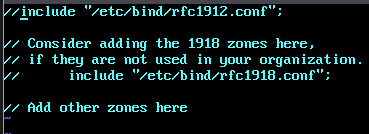

* Отключите chroot:

```bash
control bind-chroot disabled
```

* Отключите KRB5RCACHETYPE:

```bash
echo 'KRB5RCACHETYPE="none"' >> /etc/sysconfig/bind
```

* Подключите плагин BIND\_DLZ:

```bash
echo 'include "/var/lib/samba/bind-dns/named.conf";' >> /etc/bind/named.conf
```

* Отредактируйте файл **/etc/bind/options.conf**:
  + в раздел **options** добавьте строки:
    - **tkey-gssapi-keytab** — путь к ключевой таблице для GSS-API (интеграция с Kerberos);
    - **minimal-responses** — уменьшает объём ответов;
    - **listen-on** — IP-адреса, на которых принимаются запросы;
    - **allow-query** — разрешённые подсети для DNS-запросов;
    - **allow-recursion** — подсети, которым разрешены рекурсивные запросы;
    - **forwarders** — внешние DNS-серверы для пересылки;;
    - **forward first** — сначала пересылать, затем кешировать;

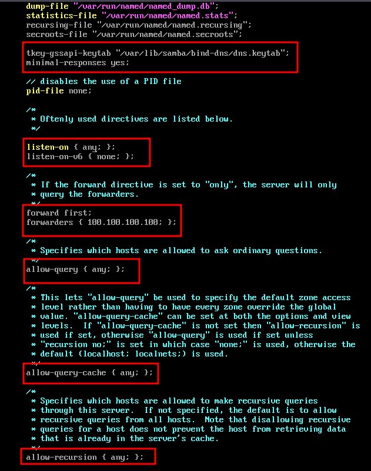

* + в раздел **logging** добавьте строку:
    - **logging** —  подавление предупреждений о «lame servers»

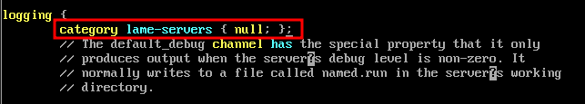

* Восстановить к начальному состоянию Samba:

```bash
rm -f /etc/samba/smb.conf
```

```bash
rm -f /etc/samba/smb.conf
```

```bash
rm -rf /var/cache/samba
```

```bash
mkdir -p /var/lib/samba/sysvol
```

* Интерактивное создание домена:

```bash
samba-tool domain provision
```

* + в качестве **DNS backend** указать **BIND9\_DLZ**

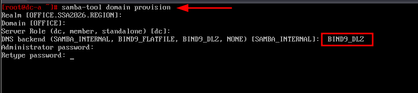

* + результат успешного создания домена в интерактивном режиме:

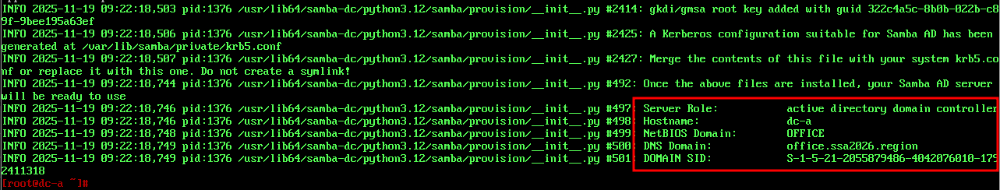

* Включить в автозагрузку службы **samba** и **bind,** также запустить их:

```bash
systemctl enable --now samba
```

```bash
systemctl enable --now bind
```

* При создании домена Samba автоматически генерирует корректный файл **krb5.conf** для домена в каталоге **/var/lib/samba/private/**
  + Можно просто заменить этим файлом файл, находящийся в каталоге **/etc/**:

```bash
cp /var/lib/samba/private/krb5.conf /etc/krb5.conf
```

* Перезагрузить службу **samba**:

```bash
systemctl restart samba
```

* Просмотр общей информации о домене можно выполнить с помощью команды **samba-tool domain info 127.0.0.1**:

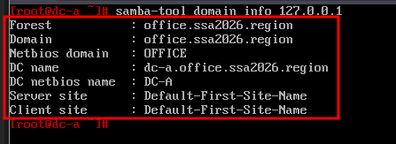

* Просмотр предоставляемых служб можно выполнить с помощью команды **smbclient -L localhost -Uadministrator**:
  + **netlogon** и **sysvol** создаются автоматически и необходимы для работы контроллера домена

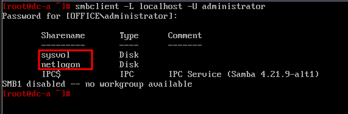

* Проверка конфигурации DNS:
  + проверка наличия **nameserver 127.0.0.1** в **/etc/resolv.conf**:

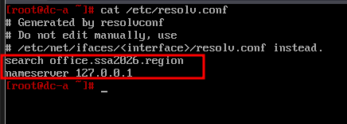

* + проверка имён хостов "**\_kerberos.\_udp.**":

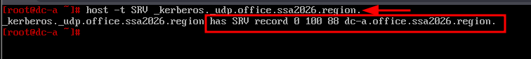

* + проверка имён хостов "**\_ldap.\_tcp.**":

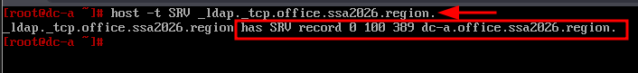

* + проверка имён хостов "**адрес хоста.**":

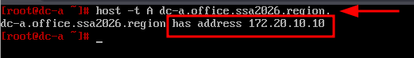

* Проверка Kerberos-аутентификации (имя домена должно быть в верхнем регистре):

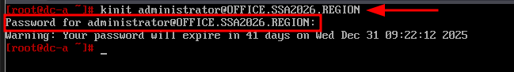

* Просмотр полученного билета:

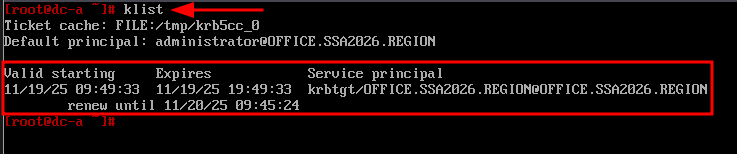

#### cli1-a и cli2-a (alt-workstation):

* Для ввода в дломен установим пакет **task-auth-ad-sssd**:

```bash
apt-get update && apt-get install -y task-auth-ad-sssd
```

* Для ввода компьютера в домен в **ЦУС** необходимо выбрать пункт **Пользователи** → **Аутентификация**
* В окне модуля **Аутентификация** следует выбрать пункт **Домен Active Directory**, заполнить поля (Домен, Рабочая группа, Имя компьютера), выбрать пункт SSSD (в единственном домене) и нажать кнопку **Применить**

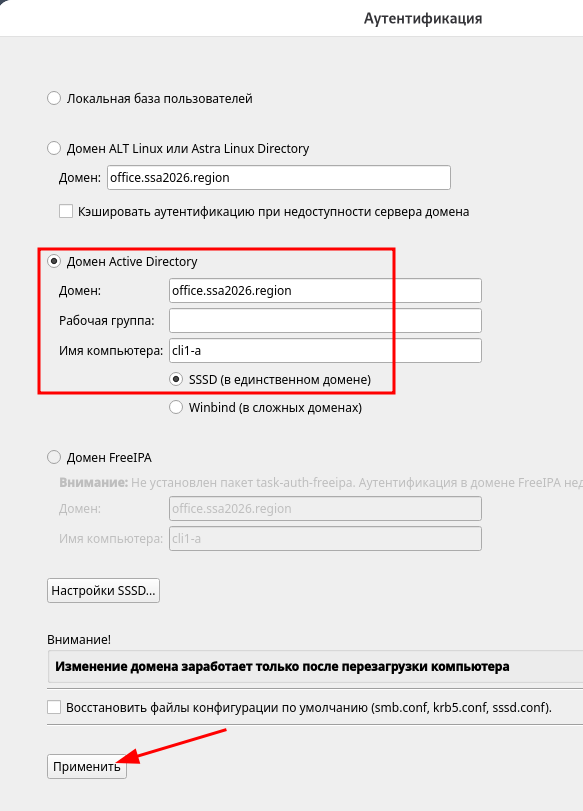

* В открывшемся окне необходимо ввести имя пользователя, имеющего право вводить машины в домен, и его пароль и нажать кнопку **ОК**:

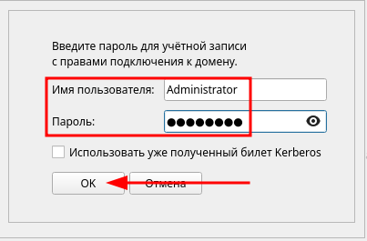

* Результат успешного присоединения к домену:

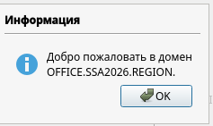

* Перезагрузить рабочую станцию для применения всех настроек

#### cli1-a (alt-workstation):

* Установить пакет **admc**:

```bash
apt-get install -y admc
```

* Запуск **ADMC** осуществляется из меню запуска приложений: пункт **Системные** → **ADMC** или из командной строки (команда **admc**)
* Для запуска ADMC необходимо предварительно получить ключ Kerberos для администратора домена:

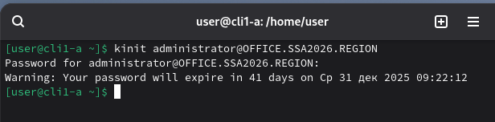

* Результат успешного запуска **admc**:

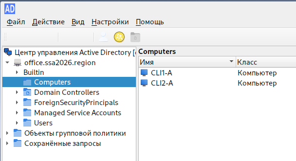

* Создать **ofadmins**:


* Создать **ofusers**:

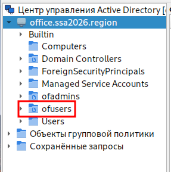

* Создать группу **ofadmins** в подразделение **ofadmins**:

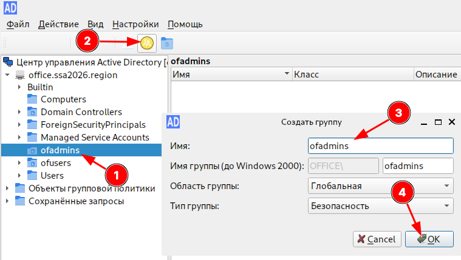

* Создать группу **ofusers** в подразделение **ofusers**:

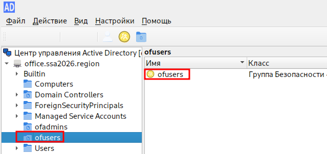

* Создать пользователя **ofadmin1** в подразделение **ofadmins**:

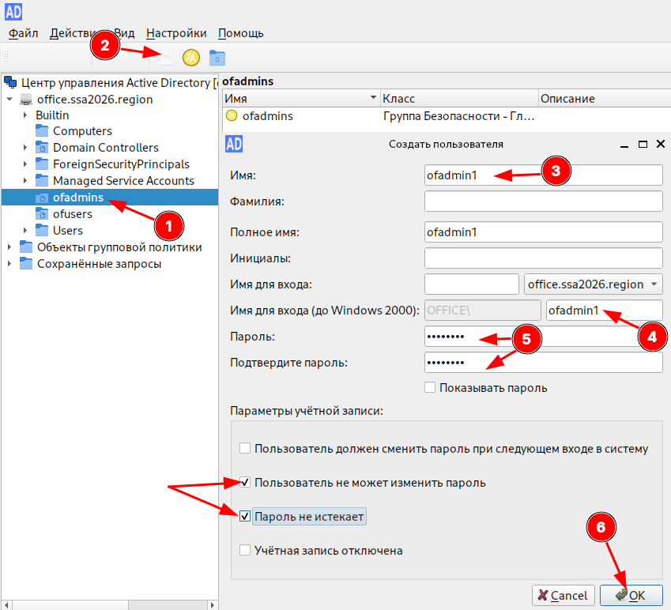

* + Добавить созданного пользователя в группу **ofadmins**:

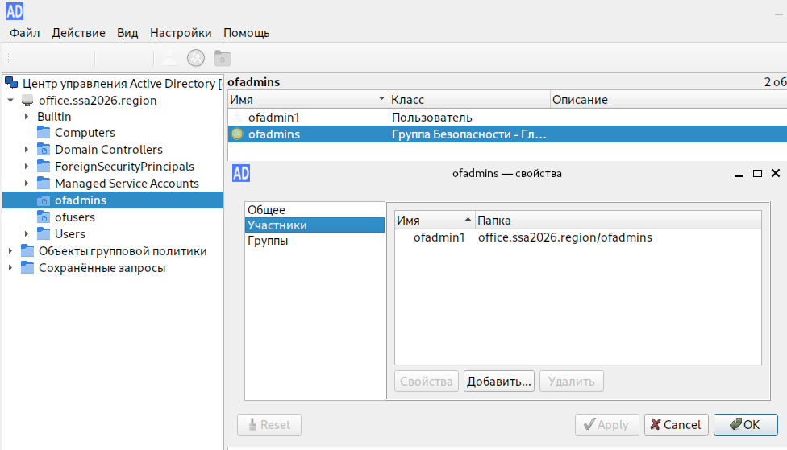

* Создать пользователя **ofuser1** в подразделение **ofusers**
  + Добавить созданного пользователя в группу **ofusers**

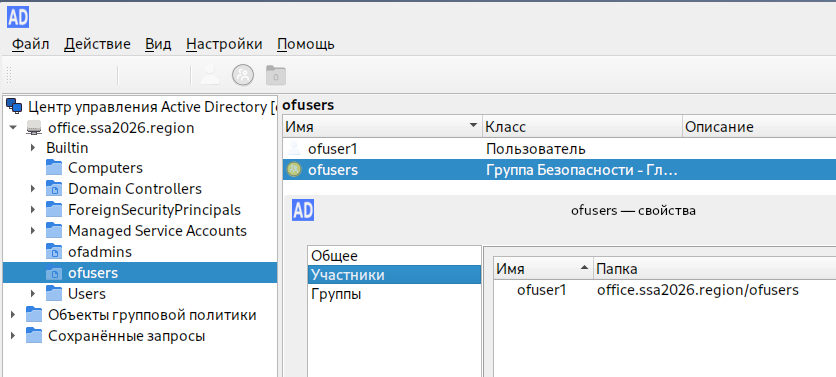

* Создать пользователя **user1**:

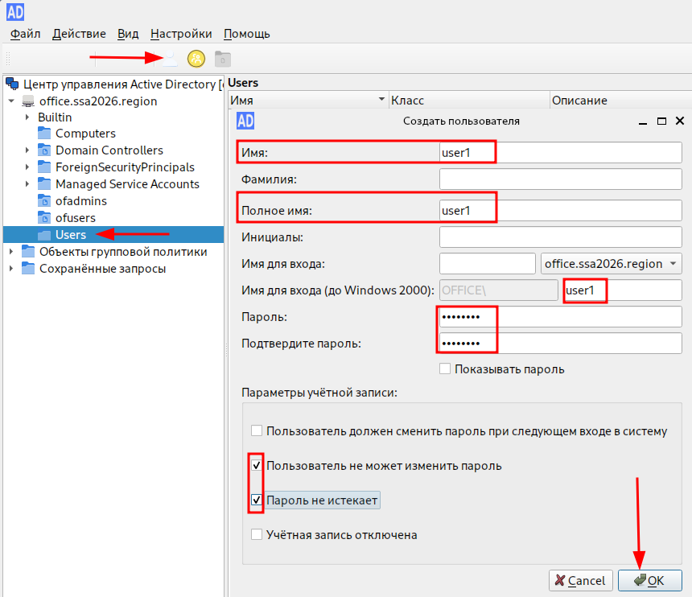

#### cli2-a или cli1-a (alt-workstation):

* Проверить возможность входа из-под созданных пользователей:
  + **ofadmin1:**

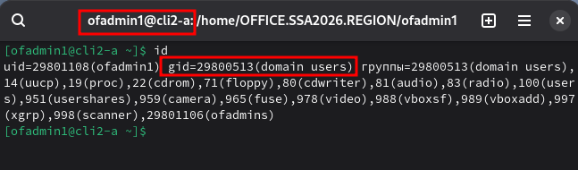

* + **ofuser1:**

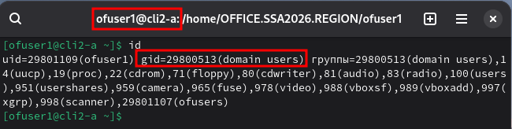

* + **user1:**

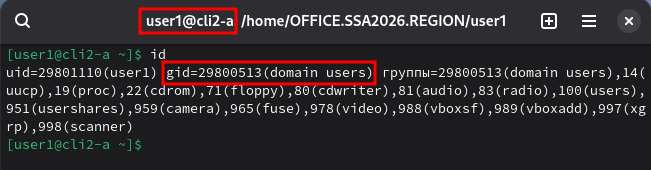

#### cli1-a и cli2-a (alt-workstation):

* Необходимо установить пакет **gpupdate**:

```bash
apt-get install -y gpupdate
```

* Включить модуль групповых политик:

```bash
gpupdate-setup enable
```

#### cli1-a (alt-workstation):

* Установим пакет **gpui**, для редактирования настроек клиентской конфигурации:

```bash
apt-get install -y gpui
```

* В оснастке ADMC - переходим в раздел **Объекты групповой политики -> ПКМ**по **office.ssa2026.region** и нажимаем **Создать политику и связать с этом подразделением**:

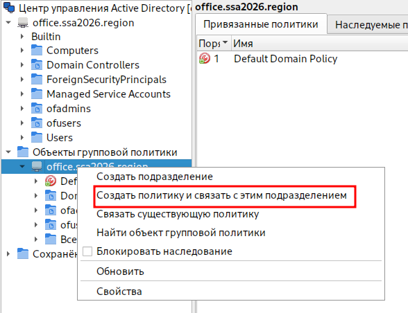

* Задаём имя и нажимаем **ОК**:

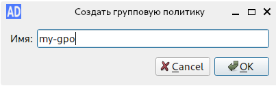

* Выбираем созданную групповую политику **ПКМ** и нажимаем **Изменить**:

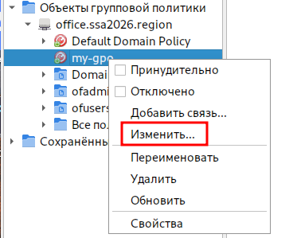

* В соответствие с требованиями задания - реализуем необходимый функционал:
  + Задаём картинку компании для рабочего стола и запрещаем её менять
    - но, чтобы на **cli2-a** (или же из под любого другого пользователя) картинка также была установлена, её необходимо разместить на общем ресурсе (например, создав общую папку)

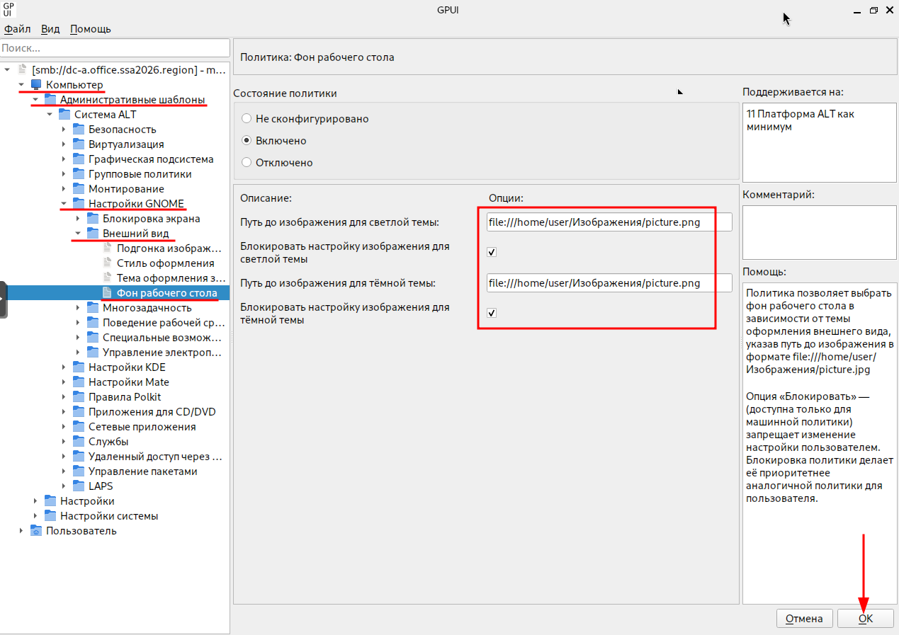

* + - опционально (необязательно):


* + Запрещаем изменение сетевых настроек:
    - пройтись по всему списку и выставить **Включено**, с вариантом ограничений **No** (выставить чек-бокс **Блокировать**):


* Проверить, перезагружаем **cli1-a**и **cli2-a**:
  + картинка фона рабочего стола должна быть установлена:


* + при попытке отключить сетевой интерфейс, данная возможность отсутствует:


Последнее изменение: среда, 19 ноября 2025, 14:16