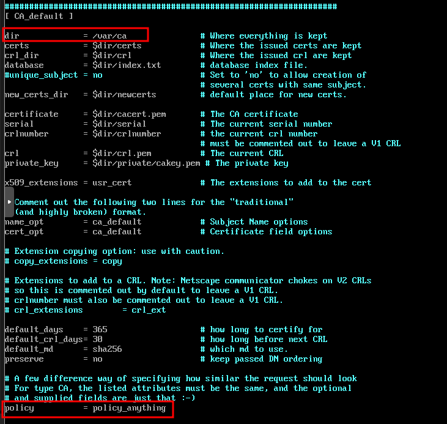
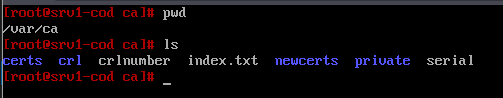
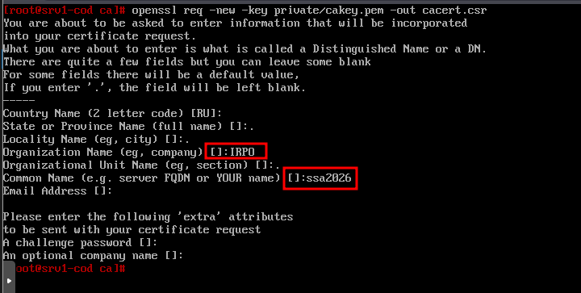
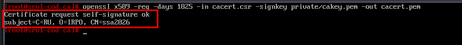
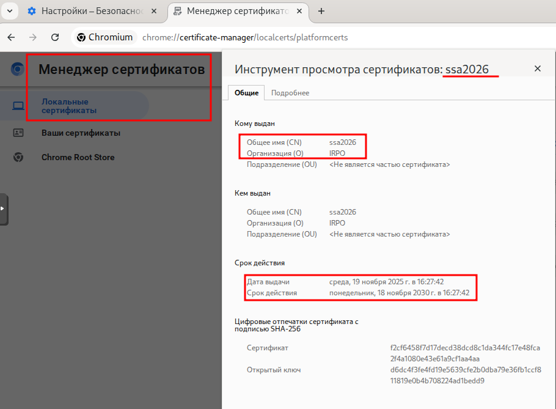
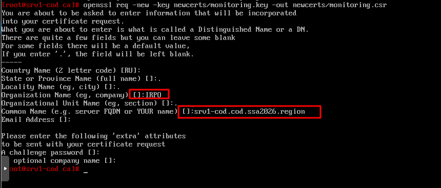
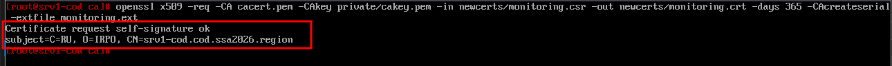
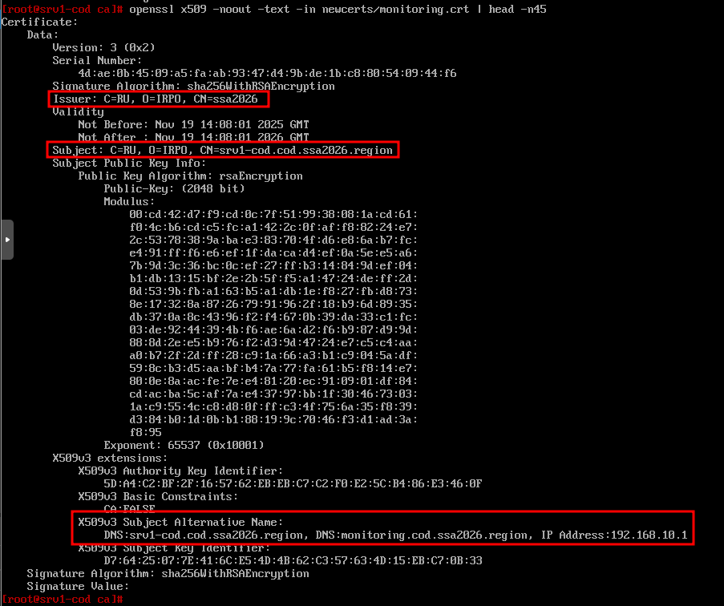

# 17. Настройка центра сертификации

### Вариант реализации:

#### 

#### srv1-cod (alt-server):

* Создадим директорию **/var/ca**:

```bash
mkdir /var/ca
```

* Отредактируем конфигурационный файл **/etc/openssl/openssl.cnf**:



* Перейдём в директорию **/var/ca** и создадим необходимую структуру:

```bash
cd /var/ca
```

```bash
mkdir certs
```

```bash
mkdir crl
```

```bash
mkdir newcerts
```

```bash
mkdir private
```

```bash
touch index.txt
```

```bash
touch serial
```

```bash
touch crlnumber
```

```bash
echo 01 > serial
```

```bash
echo 01 > crlnumber
```

* Должна получиться следующая структура:



* Создадим ключ:

```bash
openssl genrsa -out private/cakey.pem
```

* Создадим запрос:

```bash
openssl req -new -key private/cakey.pem -out cacert.csr
```

* + Указав имя организации и центра сертификации:



* Подписываем запрос и выпускаем сертификат сроком на 5 лет:



* Разрешим доступ до **srv1-cod** по **SSH** для пользователя **root**

#### cli-cod, admin-cod, cli1-a и cli2-a (alt-workstation):

* Забираем через **scp** корневой сертификат и помещаем его в локальное хранилище сертификатов:

```bash
scp root@srv1-cod.cod.ssa2026.region:/var/ca/cacert.pem /etc/pki/ca-trust/source/anchors/ca.crt
```

* Обновляем:

```bash
update-ca-trust
```

* Проверить в браузере наличие корневого УЦ:



#### srv1-cod (alt-server):

* Перейдём в директорию **/var/ca**:

```bash
cd /var/ca
```

* Создаём ключ для сертификата (для системы мониторинга):

```bash
openssl genrsa -out necerts/monitoring.key
```

* Создаём запрос на подпись (для системы мониторинга):

```bash
openssl req -new -key newcerts/monitoring.key -out newcerts/monitoring.csr
```

* + Результат:



* Создадим файл с расширениями:

```bash
cat <<EOF > monitoring.ext
  authorityKeyIdentifier=keyid,issuer
  basicConstraints=CA:FALSE
  subjectAltName=@alt_names
  [alt_names]
  DNS.1=srv1-cod.cod.ssa2026.region
  DNS.2=monitoring.cod.ssa2026.region
  IP.1=192.168.10.1
EOF
```

* Подписываем запрос выпуская сертификат (для системы мониторинга):

```bash
openssl x509 -req -CA cacert.pem -CAkey private/cakey.pem -in newcerts/monitoring.csr -out newcerts/monitoring.crt -days 365 -CAcreateserial -extfile monitoring.ext
```

* + Результат:



* Проверить содержимое сертификата:



Последнее изменение: среда, 19 ноября 2025, 17:06