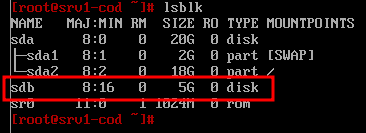
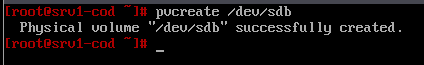
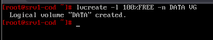
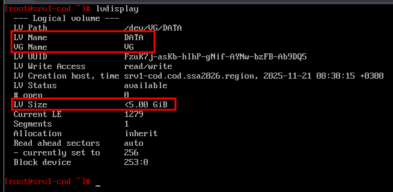
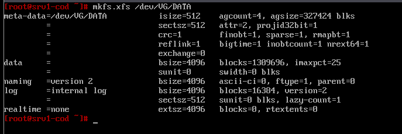
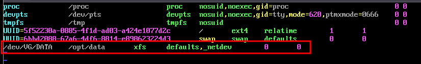
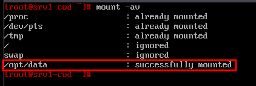
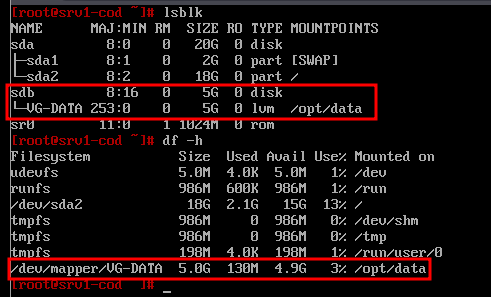

# 20. Настройка устройства хранения данных (LVM)

### Вариант реализации:

#### 

#### srv1-cod (alt-server):

* Реализуем LVM-том:
  + при помощи утилиты **lsblk** необходимо определить диск который будет использоваться:
  + в данном случае будет использоваться диск **sdb** (ранее подключённый по iSCSI)



* Помечаем диски, что данный диск будет использоваться для LVM:

```bash
pvcreate /dev/sdb
```

* + результат:



* Создаём группу логических томов с именем **VG**:

```bash
vgcreate VG /dev/sdb
```

* + результат:


* Создадим логический том с именем **DATA**, используя **100%** дискового пространства:

```bash
lvcreate -l 100%FREE -n DATA VG
```

* + результат:



* Проверить можно с помощью команды **lvdisplay**:



* + в качестве файловой системы используем **xfs**:

```bash
mkfs.xfs /dev/VG/DATA
```

* + результат:



* Настраиваем **автоматическое монтирование** логического тома в **/opt/data**:  
  + создадим директорию для монтирования:

```bash
mkdir /opt/data
```

* Добавляем в файл **/etc/fstab** следующую строку для автоматического монтирования логического тома **DATA**:
  + - *P.S. или на основе **UUID***



* Выполняем монтирование:

```bash
mount -av
```

* + результат:



* Проверить можно с помощью команд **lsblk** или **df**:



Последнее изменение: пятница, 21 ноября 2025, 09:31