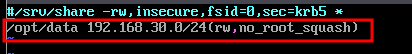
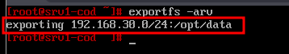
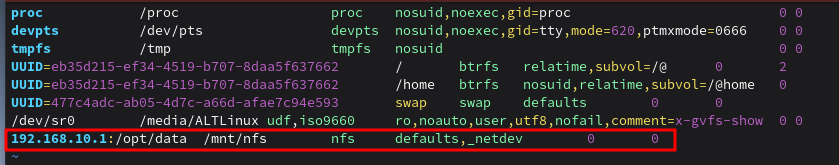
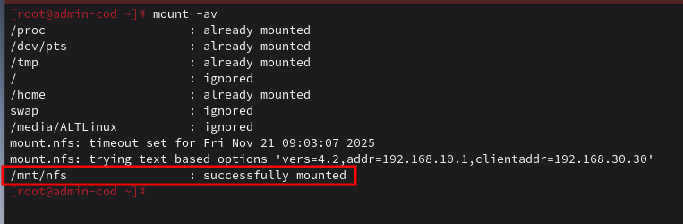
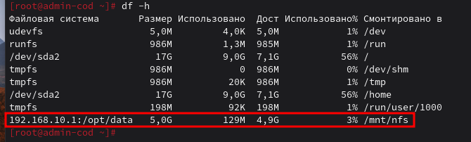
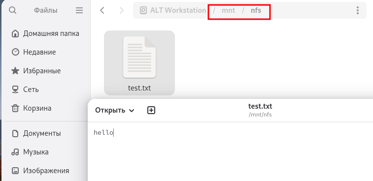
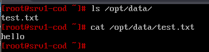

# 21. Настройка устройства хранения данных (NFS)

### Вариант реализации:

#### 

#### srv1-cod (alt-server):

* Устанавливаем пакеты для NFS сервера:

```bash
apt-get install -y nfs-server nfs-utils
```

* Назначаем права на созданную ранее директорию для общего доступа (полный доступ):

```bash
chmod 777 /opt/data
```

* Редактируем файл **/etc/exports**:

* + Добавляем туда следующую информацию



* Экспортируем файловую систему, указанную выше в **/etc/exports**:

```bash
exportfs -arv
```

* + Результат:



* Запускаем и добавляем в автозагрузку NFS - сервер:

```bash
systemctl enable --now nfs-server
```

#### admin-cod (alt-workstation):

* Выполняем установку пакетов для NFS - клиента:

```bash
apt-get update && apt-get install -y nfs-utils nfs-clients
```

* Создадим директорию для монтирования общего ресурса:

```bash
mkdir /mnt/nfs
```

* Задаём права на созданную директорию:

```bash
chmod 777 /mnt/nfs
```

* Настраиваем автомонтирование общего ресурса через **fstab**:

* + Добавляем следующую информацию:



* Выполняем монтирование общего ресурса:

```bash
mount -av
```

* + Результат:



* Проверяем:

```bash
df -h
```

* + Результат:



* Перезугружаем **admin-cod** и проверяем автомонтирование с правами на запись:



* Результат на сервере **srv1-cod**:



Последнее изменение: пятница, 21 ноября 2025, 08:58