# 22. Настройка системы мониторинга

### Вариант реализации:

#### 

#### srv2-cod (alt-server):

* Устанавливаем пакет **zabbix-server-pgsql**:

```bash
apt-get update && apt-get install -y zabbix-server-pgsql
```

* Создаём пользоавтеля **zabbix\_user** в базе данных **PostgreSQL**:

```bash
su - postgres -s /bin/sh -c 'createuser --no-superuser --no-createdb --no-createrole --encrypted --pwprompt zabbix_user'
```

* + После запуска данной команды - задаём в качестве пароля для пользователя **zabbix\_user** - пароль **P@ssw0rdZabbix** и подтверждаем его:

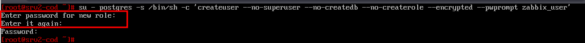

* Создаём базу данных с именем **zabbix**:

```bash
su - postgres -s /bin/sh -c 'createdb -O zabbix_user zabbix'
```

* Выполняем перезагрузку службы **postgresql**:

```bash
systemctl restart postgresql
```

* Добавляем в базу данные для веб-интерфейса:

```bash
su - postgres -s /bin/sh -c 'psql -U zabbix_user -f /usr/share/doc/zabbix-common-database-pgsql-*/schema.sql zabbix'
```

```bash
su - postgres -s /bin/sh -c 'psql -U zabbix_user -f /usr/share/doc/zabbix-common-database-pgsql-*/images.sql zabbix'
```

```bash
su - postgres -s /bin/sh -c 'psql -U zabbix_user -f /usr/share/doc/zabbix-common-database-pgsql-*/data.sql zabbix'
```

#### srv1-cod (alt-server):

* Устанавливаем пакеты для веб-сервера **apache2**:

```bash
apt-get install -y apache2 apache2-mod_{php8.2,ssl}
```

* Включаем и добавляем в автозагрузку службу отвечающую за веб-сервер **apache2**:

```bash
systemctl enable --now httpd2
```

* Установим **PHP** и необходимые модули для корректной работы:

```bash
apt-get install -y php8.2 php8.2-{mbstring,sockets,gd,xmlreader,pgsql,ldap,openssl}
```

* Меняем некоторые опции **php** в файле **/etc/php/8.2/apache2-mod\_php/php.ini**:

* + Находим следующие параметры и приводим их к следующему виду:

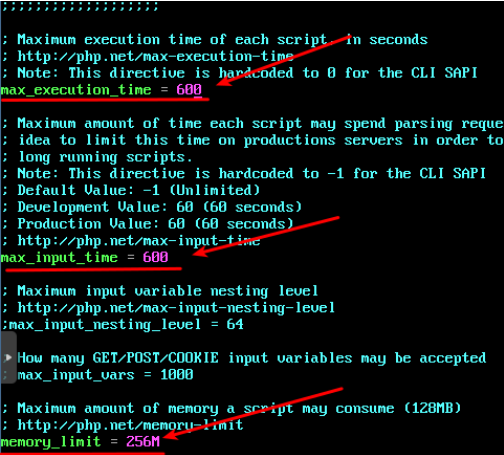

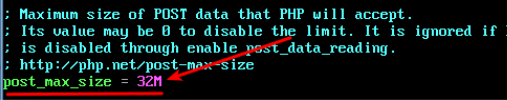

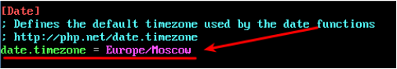

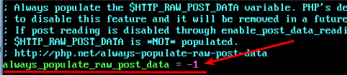

* Перезапускаем службу отвечающую за веб-сервер **apache2**:

```bash
systemctl restrart httpd2
```

* Устанавливаем **zabbix-server-pgsql**:

```bash
apt-get install -y zabbix-server-pgsql
```

* Вносим изменения в конфигурационный файл **/etc/zabbix/zabbix\_server.conf:**
  + Добавляем следующие изменения:


* Добавим **Zabbix-сервер** в автозапуск и запустить его:

```bash
systemctl enable --now zabbix_pgsql
```

* Установка веб-интерфейса Zabbix:

```bash
apt-get install zabbix-phpfrontend-{apache2,php8.2} -y
```

* Создаём файл конфигурации Virtualhost для Zabbix **/etc/httpd/conf/sites-available/zabbix.conf**:
  + Cодержимое:

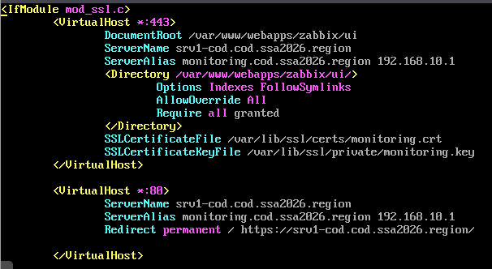

* Копируем ранее созданные сертификаты:

```bash
 cp /var/ca/newcerts/monitoring.crt /var/lib/ssl/certs/
```

```bash
 cp /var/ca/newcerts/monitoring.key /var/lib/ssl/private/
```

* Добавляем символьную ссылку на файл **/etc/httpd/conf/sites-available/zabbix.conf**:

```bash
ln -s /etc/httpd/conf/sites-available/zabbix.conf /etc/httpd/conf/sites-enabled/
```

* Включаем модуль **ssl** и **rewrite**, а также порт **https**:

```bash
a2enmod ssl; a2enmod rewrite; a2enport https
```

* Проверяем синтаксис конфигурационного файла **/etc/httpd/conf/sites-available/zabbix.conf**:

```bash
apachectl -t
```

* + Результат:

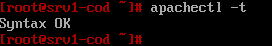

* Назначаем владельца и группу владельцев для файлов проекта **zabbix**:

```bash
chow -R apache2:apache2 /var/www/webapps/zabbix
```

* Перезагружаем службу **httpd2**:

```bash
systemctl restart httpd2
```

#### admin-cod (alt-workstation):

* Продолжаем установку **zabbix** - через веб-интерфейс:  
  + переходим на **[https://srv1-cod.cod.ssa2026.region](https://srv1-cod.cod.ssa2026.region/)** и нажимаем **Next step**:

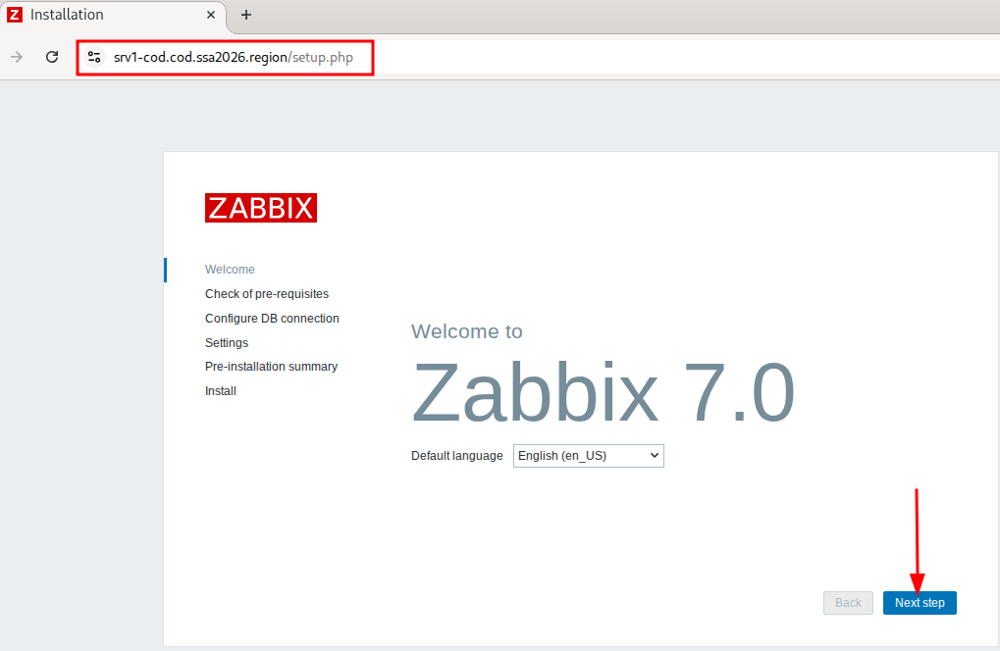

* + нажимаем **Next step**:

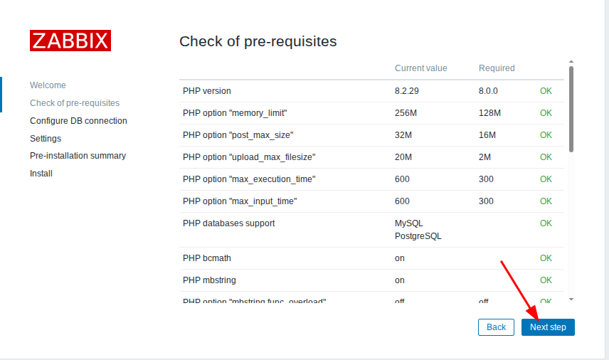

* + В качестве базы данных выбираем - **PostgreSQL**;
  + В качестве сервера базы данных указываем **IP** - адрес или имя **srv2-cod.cod.ssa2026.region****;**
  + Указываем имя созданной базы данных **zabbix;**
  + Указываем имя созданного пользователя **zabbix\_user;**
  + Указываем пароль для пользователя zabbix  **P@ssw0rdZabbix**;
  + Нажимаем **Next step**

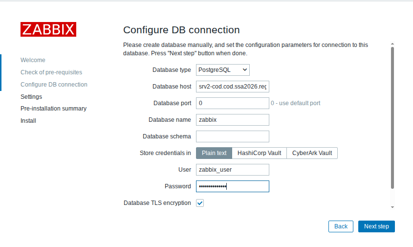

* + при необходимости задаём имя серверу и нажимаем **Next step**

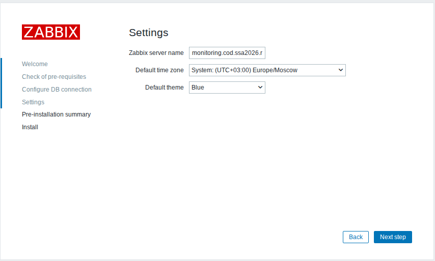

* + проверяем введённые ранее параметры и нажимаем **Next step**

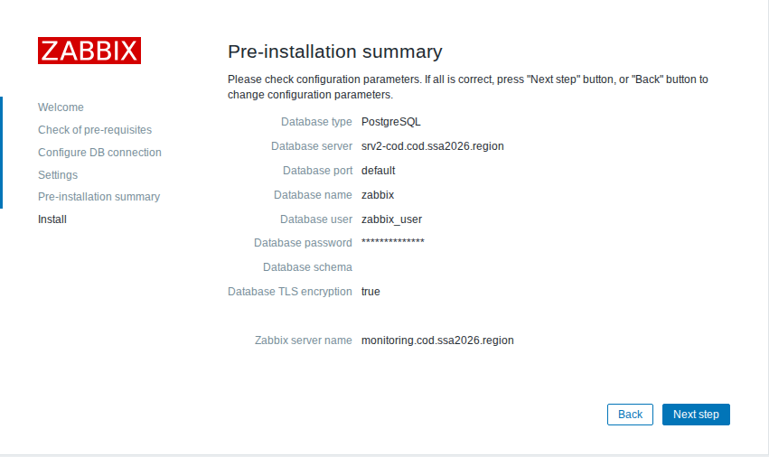

* + нажимаем **Finish**

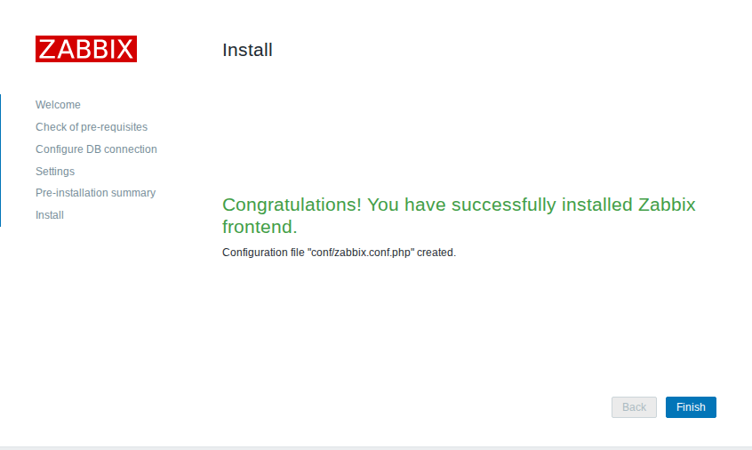

* + выполняем вход из под пользователя по умолчанию: **Admin** с паролем: **zabbix**

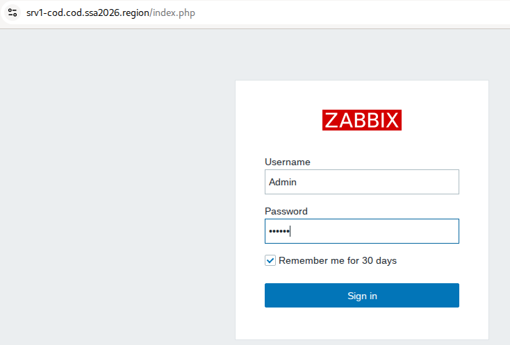

* Результат:

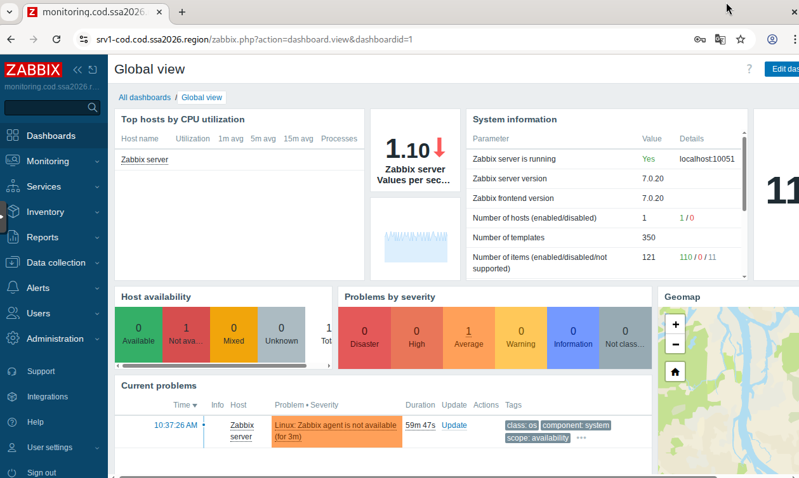

* В качестве пароля для пользователя**Admin -**необходимо установить**P@ssw0rd:**
  + переходим в настройки аутентификации и снимаем галочку, которая запрещает использование слабых паролей

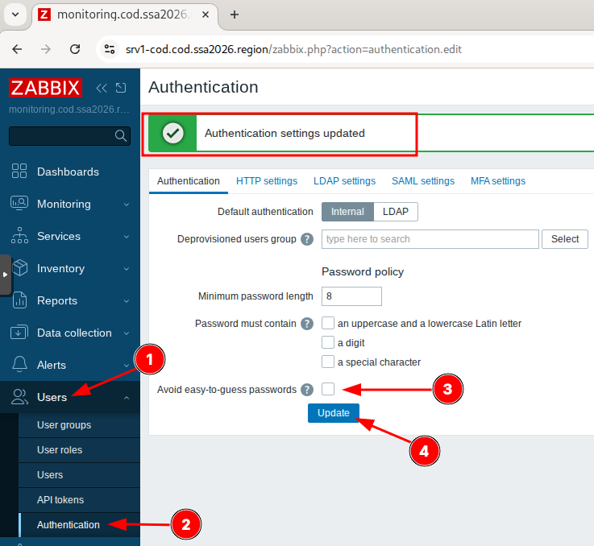

* Задаём новый пароль **P@ssw0rd**- для пользователя **Admin**

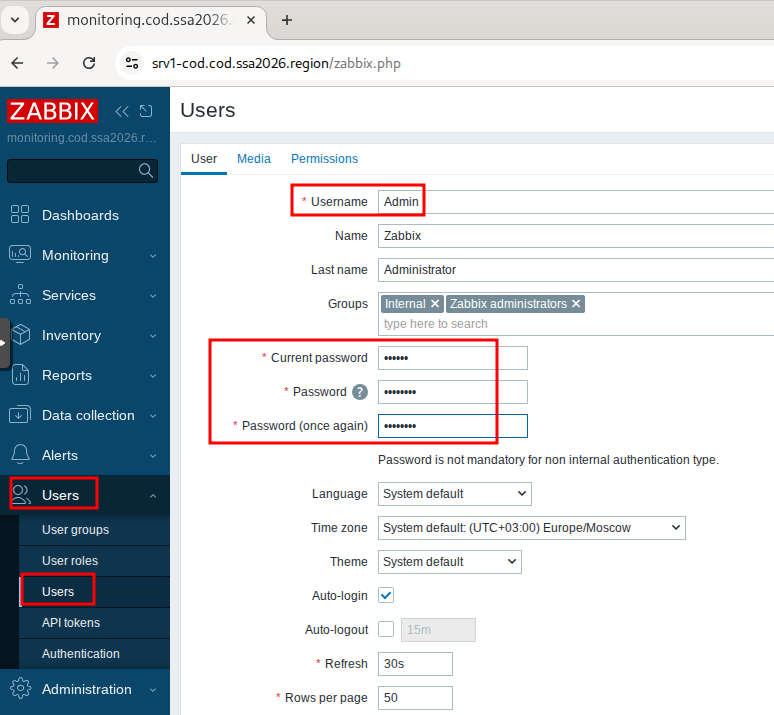

#### srv1-cod, srv2-cod, dc-a, sw1-cod, sw2-cod, sw1-a, sw2-a (alt-server):

* Устанавливаем необходимый пакет **zabbix-agent**:

```bash
apt-get install zabbix-agent -y
```

* Редактируем конфигурационный файл **/etc/zabbix/zabbix\_agentd.conf:**
  + вносим следующие изменения:

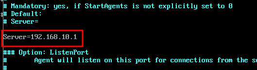

* + в поле **Hostname** необходимо указывать полное доменное имя соответствующего хоста

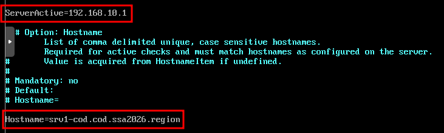

* Включаем и добавляем в автозагрузку службу **zabbix\_agentd**:

```bash
systemctl enable --now zabbix_agentd.service
```

#### admin-cod (alt-workstation):

* Переходим в веб-интерфейс управления **fw-cod:**

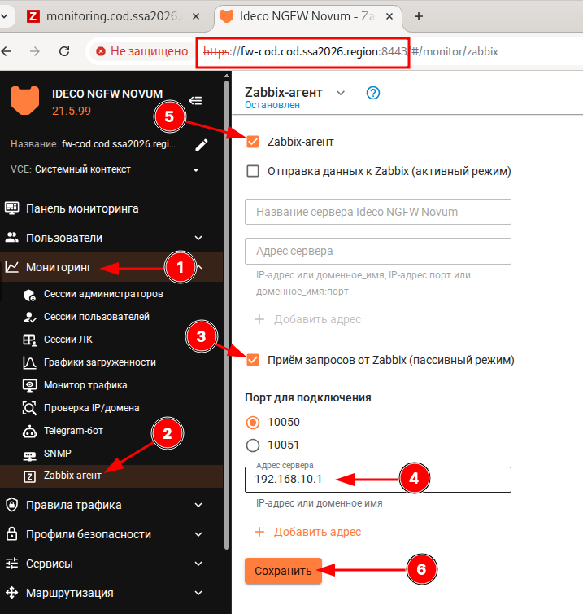

* Результат:

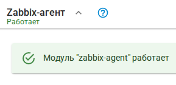

#### rtr-cod и rtr-a (ecorouter):

* Запуск сервиса SNMP:

```bash
rtr-cod(config)#snmp-server enable snmp
rtr-cod(config)#
```

* Настроить SNMP community:

```bash
 rtr-cod(config)#snmp-server community public ro 
rtr-cod(config)#write memory
Building configuration...

rtr-cod(config)#
```

#### admin-cod (alt-workstation):

* Переходим на **[https://srv1-cod.cod.ssa2026.region](https://srv1-cod.cod.ssa2026.region/)**
* Каждый хост необходимо зарегистрировать на сервере Zabbix, сделать это можно, используя веб-интерфейс
  + переходим **Monitoring -> Hosts -> Create host**:

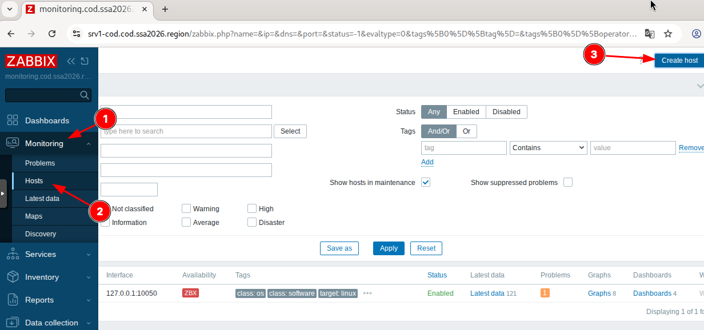

* Добавляем хосты в соответствие с требованиями задания:

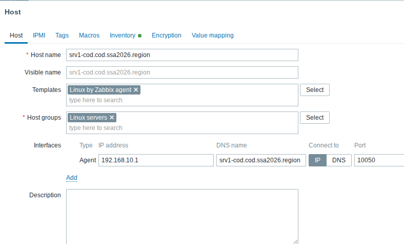

* Аналогично все остальные хосты:

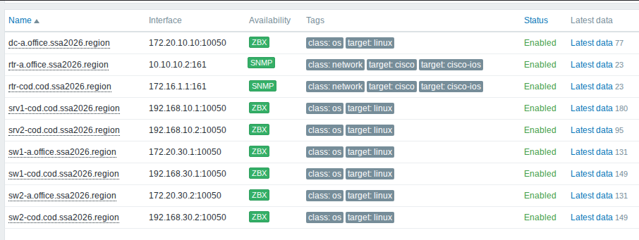

Последнее изменение: пятница, 21 ноября 2025, 12:23