# 23. Настройка IP телефонии

### Вариант реализации:

#### 

#### sip-cod ( SNG7-PBX16):

* Устанавливаем ОС:

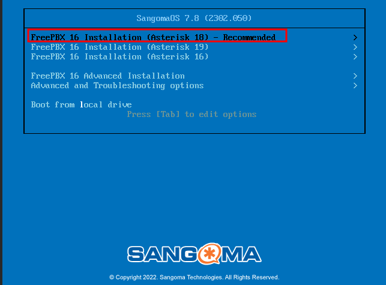

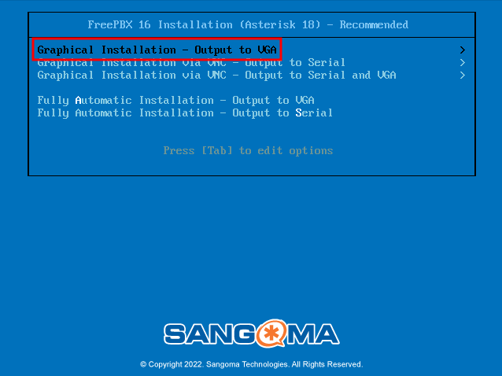

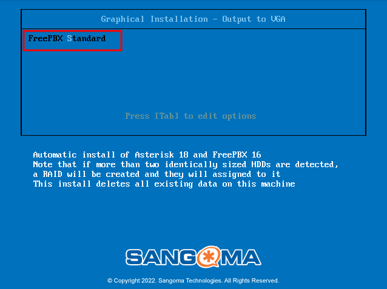

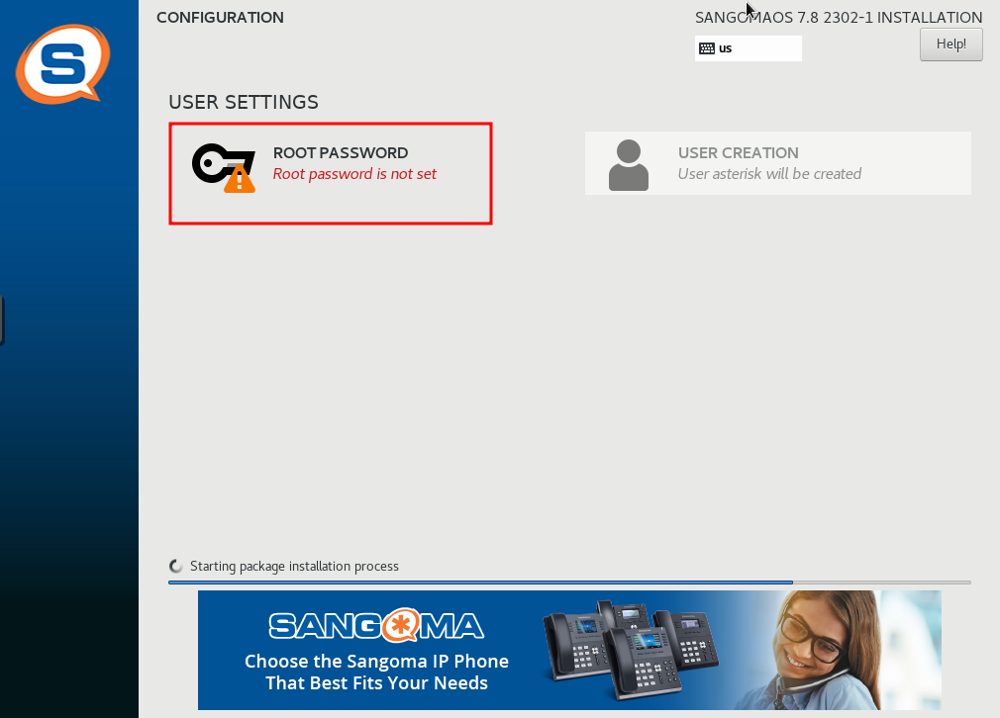

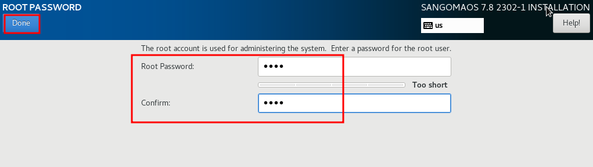

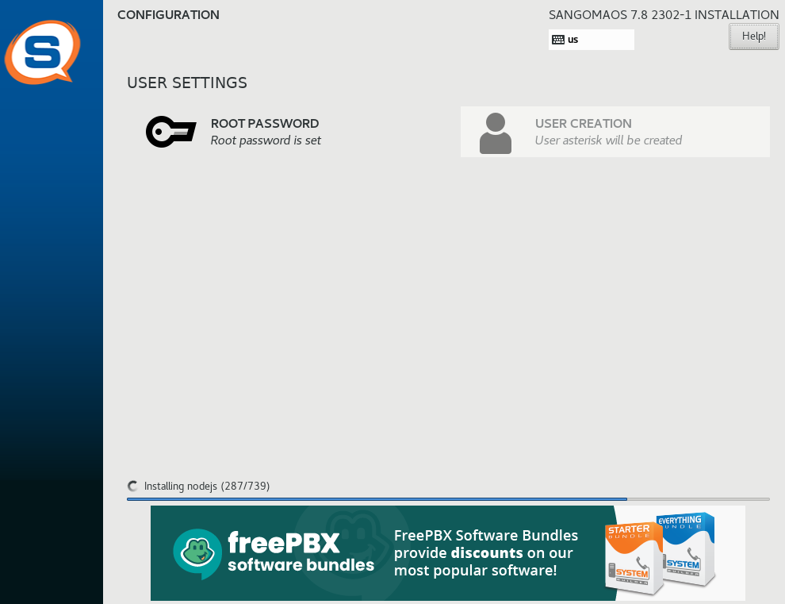

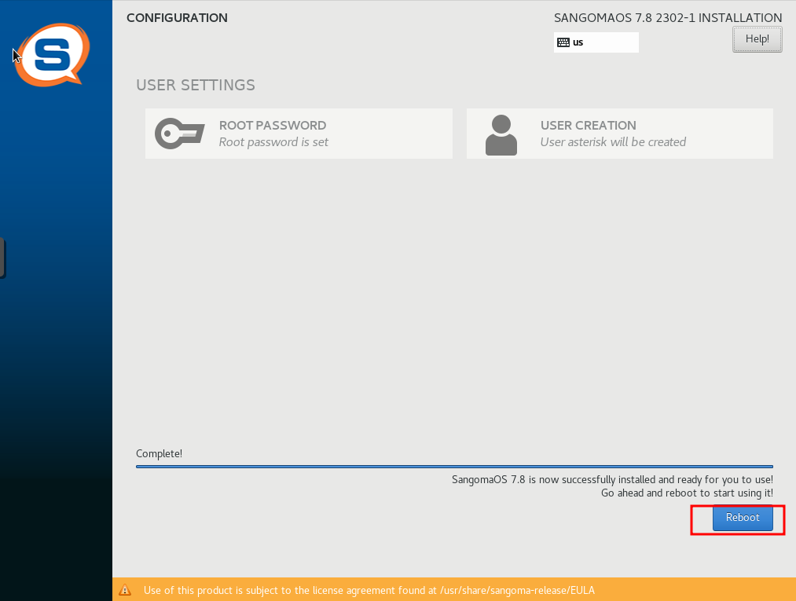

* Логинимся из-под суперпользователя **root** с паролем указанным на этапе установки ОС
* Редактируем конфигурационный файл **/etc/sysconfig/network-scripts/ifcfg-eth0**:

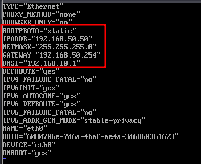

* Перезагружаем **sip-cod**:

```bash
reboot
```

* Проверяем заданные сетевые параметры:

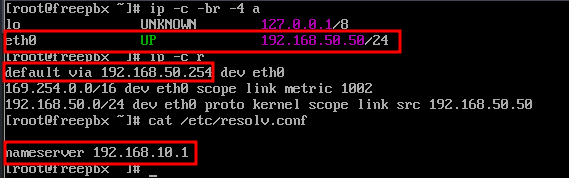

#### admin-cod (alt-workstation):

* Переходим в браузере на **192.168.50.50**:
  + Создаём учётную запись Администратора

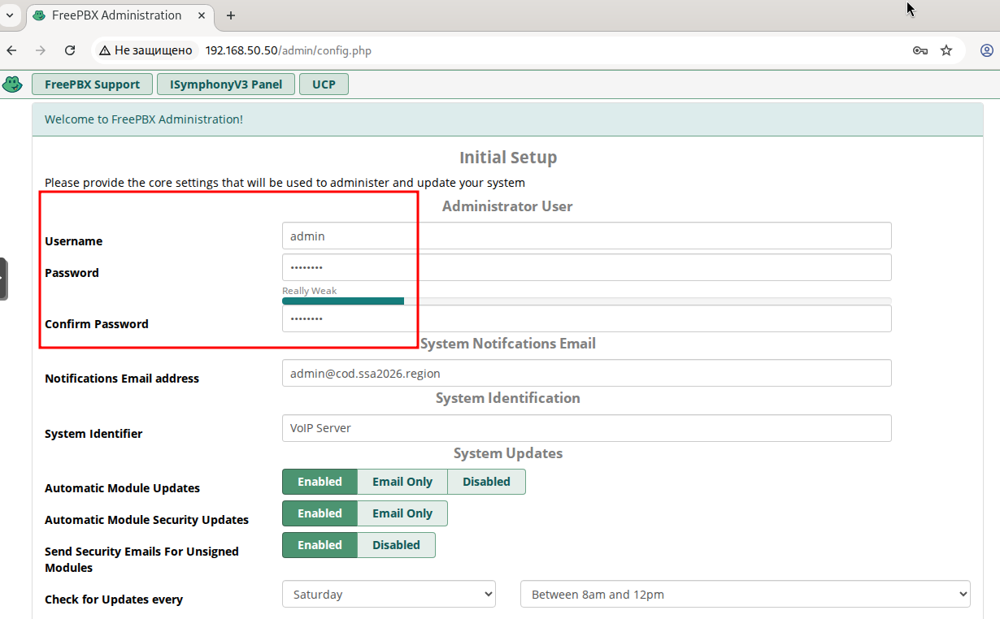

* Выбираем **FreePBX Administration:**

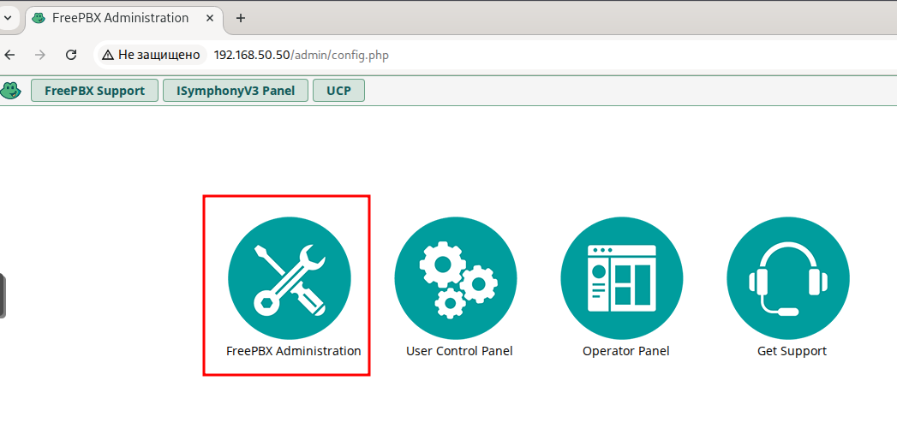

* Выполняем вход из-под созданной учётной записи:

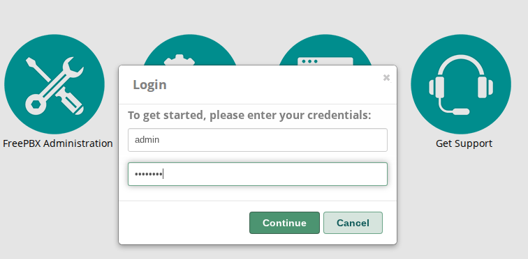

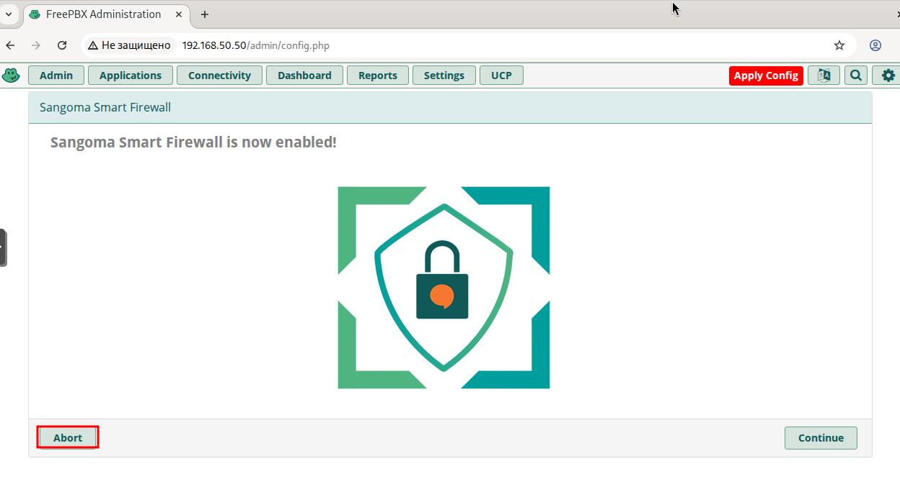

* Результат успешного входа:

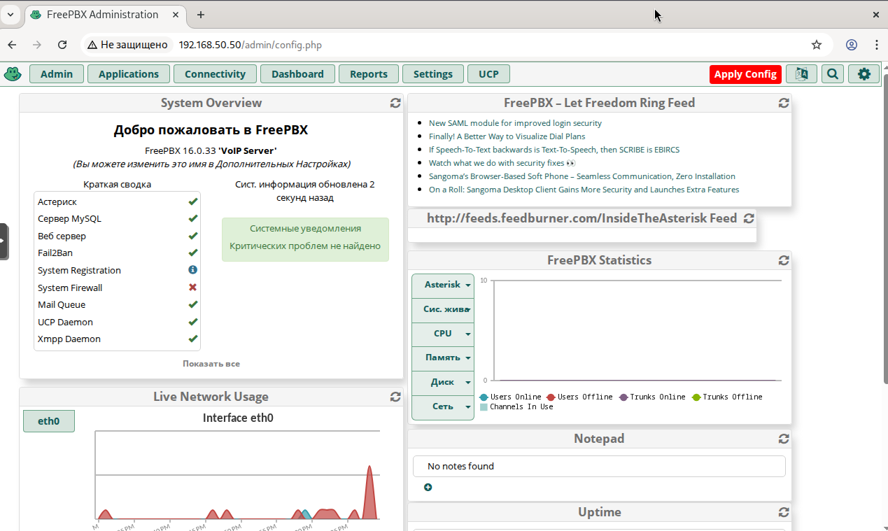

* Для реализации внутренних звонков необходимо использовать CHAN\_SIP:
  + переходим в **Settings -> Advanced Settings**:
  + ищем параметр **SIP Channel Driver** и выбираем **chan\_sip** и нажимаем **Submit**

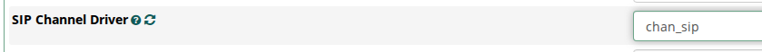

* + переходим в **Settings -> Asterisk SIP Settings**:
  + ищем параметр **Bind Port**и меняем с 5160 на **5060**и нажимаем **Submit**


* Нажимаем **Apply Config,** после чего перезагружаем **sip-cod** целиком:

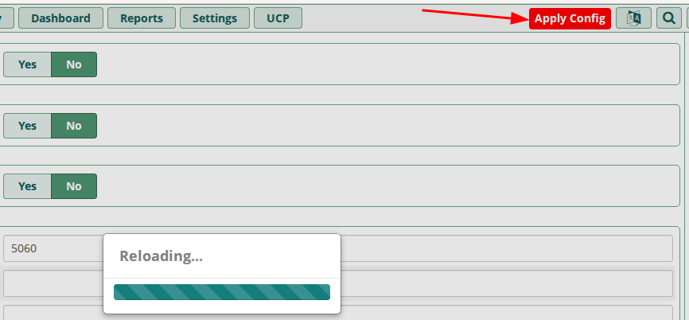

* Переходим в **Applications -> Extensions**:

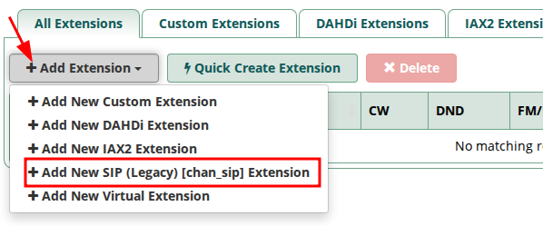

* Создаём внутренний номер и нажимаем **Submit**:

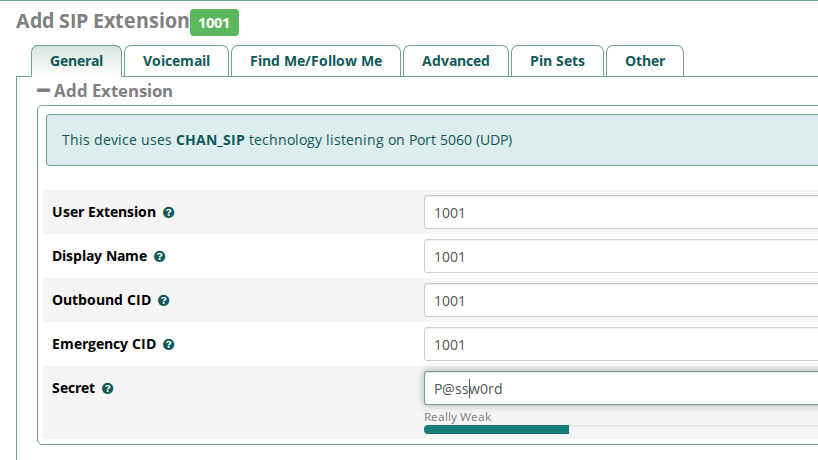

* Результат создания внутреннего номера:

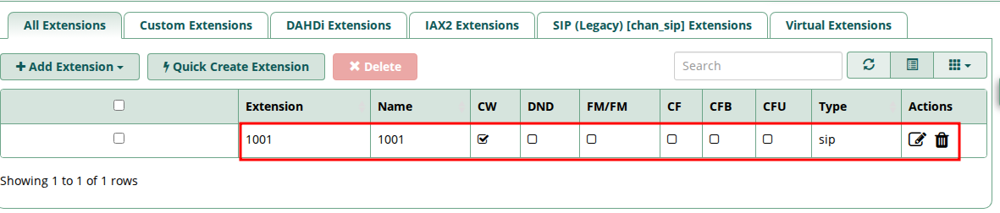

* Аналогичным образом создаём все необходимые по заданию номера:

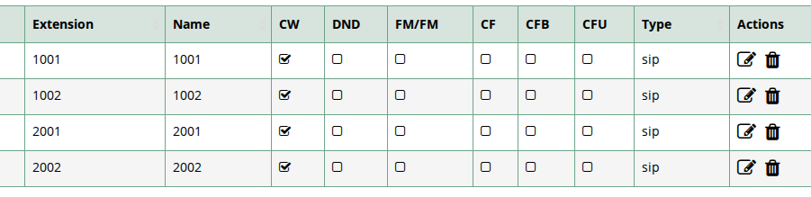

* Нажимаем **Apply Config,** после чего перезагружаем **sip-cod** целиком.

#### admin-cod, cli-cod, cli1-a и cli-a (alt-workstation):

* Устанавливаем **СофтФон**:


* Подключаемся к **sip-cod**:
  + открываем установленный СофтФон


* + в зависимости от ВМ указываем соответствующие номера:


* Проверяем звонки:


* Итог:


Последнее изменение: пятница, 21 ноября 2025, 14:17